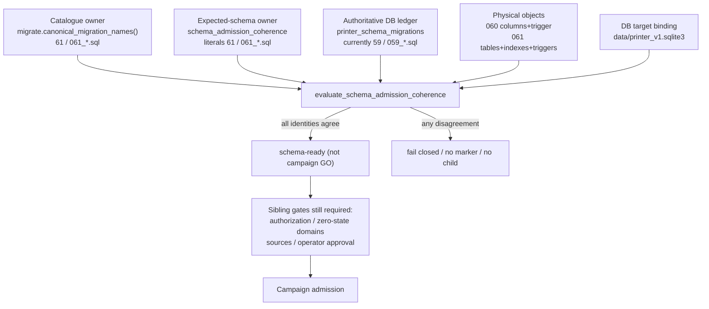
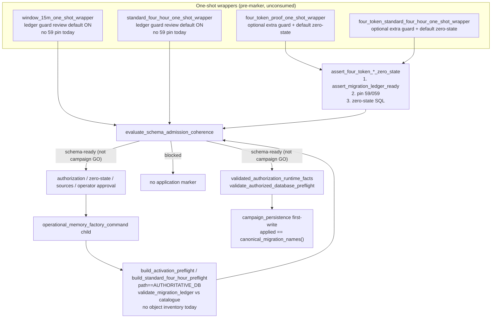
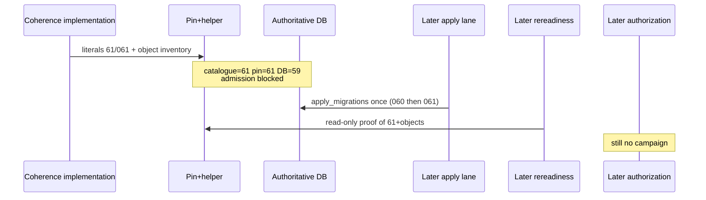

# Printer V1 V2-9.8B Post-Lane-4 Schema / Gate Coherence Design

**Document title:** V2-9.8B Post-Lane-4 Schema / Gate Coherence Design

**Author:** Printer V1 design (Grok)

**Date:** 2026-08-23

**Status:** Draft

**Lane:** design / specification only

**Inspected HEAD:** `7c32a2330f90ef47cacb2a0f9474f7fe35bc3efd`

**Branch:** `agent/v2-9-8b-consumed-4-2-2-full-operational-run-forensic-audit`

**Eventual repository path:** `docs/printer-v1-v2-9-8b-post-lane4-schema-gate-coherence-design.md`

**Governing audit:** `docs/printer-v1-post-lane4-authoritative-readiness-audit.md`

**Pattern evidence:** `docs/printer-v1-v2-9-8b-pre-lifecycle-schema-gate-coherence-design.md` and closeout

This document does not implement, apply a migration, construct or reuse an authorization, run a campaign, call providers, mutate `data/printer_v1.sqlite3`, activate Cycle 3, or begin V2-10.

---

## Overview

The repaired V2-9.8B HEAD already contains Lane-1 and Lane-3 production consumers that require Migration 060 frozen-lane columns and Migration 061 progression tables. The canonical catalogue is therefore 61 / `061_standard_4h_progression_fault_preservation.sql`. The four-token admission pin and the authoritative operational database remain 59 / `059_pair_ready_parent_terminal_cancellation_transition.sql`. Those three authorities disagree, so a fresh 4/2/2 authorization or campaign at this HEAD must fail closed.

This design specifies the minimum safe transition to the coherent end state — catalogue 61, admission expectation 61, authoritative DB 61 with the required physical objects — without ever allowing campaign admission while those identities disagree. The first implementation is a re-pin plus a single coherence evaluator. Four-token git current evidence stays `MIGRATION_059_*` until a later apply/closeout lane creates a real 061 package. Authoritative application of 060 then 061 remains a later, separately authorized maintenance lane.

---

## Background & Motivation

Forensic Lanes 1–4 are closed PASS as code repair. V2-9.8B is still the active memory-growth program and is incomplete. The last live 4/2/2 attempt consumed authorization `V2_9_8B_FOUR_TOKEN_STD4H_AUTH_20260821T153458Z_512f2436` and closed `BLOCKED_UNSAFE`. That authorization is non-reusable.

The 056 schema/gate-coherence chain is the established pattern: an audit proved catalogue / pin / DB disagreement; a design specified re-pin and later application; implementation re-pinned explicit literals; a separate lane applied the missing migration. The same class of contradiction is now two migrations deep, and this time HEAD runtime also requires physical objects that a version-number match alone cannot prove.

Current pain: every honest admission path already blocks, but the blocks are not the same question. The ledger guard and operational preflight compare the live DB to the catalogue (61). The zero-state pin still accepts 59. Physical 060/061 objects are not on the admission path at all. That is an unsatisfiable and unsafe admission contract, not a reason to loosen it.

---

## Goals & Non-Goals

**Goals**

- Name one canonical expected-schema identity owner and one coherence evaluator.
- Specify the exact 060 and 061 contracts from SQL and production consumers.
- Make new campaign admission possible only when catalogue, pin, DB ledger, required objects, and DB target are mutually coherent.
- Choose a fail-closed transition order that never admits a campaign against a schema that does not satisfy current HEAD.
- Identify the existing migration-application owner for a later lane. Do not perform that lane.
- Preserve the 056 explicit-literal pin law so a future `062_*.sql` cannot silently re-authorize admission.

**Non-goals**

- Implementing the helper, re-pin, or tests in this run.
- Applying 060 or 061 to the authoritative DB.
- Creating, reviewing, or consuming a fresh authorization.
- Reusing `…512f2436`.
- Cycle 3, V2-10, retrieval, paper decisions, BUY/SELL/HOLD, positions, PnL.
- Migration 062.
- Reverse migrations, automatic retry, ledger rewrite, or historical backfill.

---

## Key Decisions

1. **Expected-schema identity owner = explicit literals on a new coherence helper, not the catalogue.** `migrations/*.sql` via `canonical_migration_names()` remains the catalogue. The 056 closeout forbade deriving the admission pin from that directory. This design **amends the 056 file location only**, not the literal-not-derived law: the pin moves from `four_token_proof_zero_state_gate.py` Assign nodes into `schema_admission_coherence.py`. The helper holds `REQUIRED_MIGRATION_COUNT = 61` and `REQUIRED_MIGRATION_HEAD = "061_standard_4h_progression_fault_preservation.sql"` as `ast.Constant` literals. The gate import-and-rebinds those names in `__all__` only (no local `61` / `"061_…sql"` literals). Tests AST-parse the helper, not the gate, for Constants. Tests assert the literals equal the live catalogue. `EXPECTED_MIGRATION_COUNT` in the operational command stays derived from the catalogue.

2. **Re-pin to 61 before any authoritative apply.** After this implementation, the live state is catalogue=61, gate=61, DB=59: every admission path blocked. Applying first while the pin is still 59 would let catalogue-only paths (WINDOW_15M wrapper, standard-four-hour wrapper, child preflight, authorization `prepare`) pass.

3. **Version match is not sufficient.** Admission also requires the Migration 060 columns/trigger and the Migration 061 tables/indexes/triggers on the bound operational file. One inventory owner: `proof_db_schema_readiness.py` `REQUIRED_*` constants plus named 060/061 membership sets. Every `REQUIRED_TABLE_COLUMNS` key must also exist in `REQUIRED_NOT_NULL_COLUMNS` and `REQUIRED_UNIQUE_KEYS` (empty `set()` is lawful). `validate_runtime_schema_connection` **must** call `inspect_required_schema_objects` for the presence loop. The helper maps inspector issues onto `migration_060_objects_ready` / `migration_061_objects_ready` by those membership sets and must not use `runtime_ready` as the coherence result.

4. **No Migration 062.** 060 and 061 SQL can produce the required state from a clean 059 DB. Read-side inventory gaps are helper/schema-readiness work, not a new migration.

5. **Future apply uses the existing runner once.** `printer_v1.db.migrate.apply_migrations` is the only production applier. Against a 059 DB it will execute 060 then 061, each file in its own `BEGIN IMMEDIATE … COMMIT`. No mega-transaction. No campaign-startup migrate. Partial results fail closed with no automatic resume.

6. **Schema coherence never grants campaign permission.** After a later apply and rereadiness, a fresh exact-HEAD 4/2/2 authorization is still required. Consumed `…512f2436` stays dead.

7. **PR 1 does not cut over four-token git current evidence.** Profiles stay on `MIGRATION_059_PACKAGE_KIND` / `MIGRATION_059_PACKAGE_ROOT` until a later apply/closeout lane creates a real 061 package. Pin 61 and current-evidence 059 may coexist during the blocked-admission window; they must not be resolved by inventing a missing 061 evidence root.

---

## Proposed Design



Chosen end state: catalogue 61, pin 61, DB ledger 61, 060/061 objects present, target = canonical persistent DB. Until a later authorized apply lands, the helper must report not-admission-safe.

---

# Mandatory numbered sections

## 1. Exact current mismatch

Verified at HEAD `7c32a2330f90ef47cacb2a0f9474f7fe35bc3efd`.

| Authority | Owner | Observed identity | How verified |
| --- | --- | --- | --- |
| Canonical catalogue | `src/printer_v1/db/migrate.py` `canonical_migration_names()` over `migrations/*.sql` | **61** files, head `061_standard_4h_progression_fault_preservation.sql` | Directory listing: `001`…`061` contiguous |
| Admission pin | `src/printer_v1/operator_cli/four_token_proof_zero_state_gate.py` `REQUIRED_MIGRATION_COUNT` / `REQUIRED_MIGRATION_HEAD` | **59** / `059_pair_ready_parent_terminal_cancellation_transition.sql` | Source literals |
| Operational derived count | `operational_memory_factory_command.EXPECTED_MIGRATION_COUNT = canonical_migration_count()` | **61** at import | Derived; not a second pin |
| Authoritative DB ledger | `data/printer_v1.sqlite3` `printer_schema_migrations` | **59** / `059_…sql` | Post-Lane-4 audit (read-only) |
| Git current evidence | `MIGRATION_059_PACKAGE_KIND` / `MIGRATION_059_PACKAGE_ROOT` on both four-token profiles | Migration **059** evidence | `git_provenance_authorization_manifest.py` |
| Physical 060 | `printer_pre_admission_discovery_attempt_items.frozen_tracking_lane` | **absent** on authoritative DB | Audit |
| Physical 061 | `printer_memory_factory_standard_4h_progression_attempts` / `_tokens` | **absent** on authoritative DB | Audit |

Authoritative DB identity last read in the audit (this design did not re-hash or open the file for write):

- path `data/printer_v1.sqlite3`
- sha256 `17ac6ba70cbfff699b5b32d8930736e561cbe02eff0d56e698da91ed1820db13`
- size `117846016`, inode `1230526`
- integrity `ok`, FK `0`, no sidecars
- campaigns all `TERMINAL_*`

Consumed non-reusable authorization: `V2_9_8B_FOUR_TOKEN_STD4H_AUTH_20260821T153458Z_512f2436` (authorized HEAD `9a1f0a2eb1cc4f2d179b7d1a4c07a0b69c8b537b`).

If a fresh campaign were attempted now:

- `assert_migration_ledger_ready` → `migration_ledger_missing` for `060_…sql` and `061_…sql`, plus `migration_count_mismatch` 59≠61 and `migration_head_mismatch`.
- Zero-state pin would *accept* 59 if it ran alone; it does not run alone, because the same function first records `migration_ledger_drift`.
- Child `build_activation_preflight` uses `validate_migration_ledger` → fail `migration_ledger`.
- `persist_pre_admission_pair` would catch the missing-column `sqlite3.Error` and re-raise `PreAdmissionAttemptError("PAIR_PERSISTENCE_FAILED")`. That wrap is not the admission signal; the helper object check must fire first.
- `load_pre_admission_pair(..., require_frozen_lane=True)` would fail `FROZEN_TRACKING_LANE_MISSING` if columns are absent.
- `create_standard_4h_progression_aggregate` / `evaluate_standard_4h_progression` would miss 061 tables; `validate_runtime_schema_connection` would set `runtime_ready=false`. Coherence must not use that boolean as its result.

The mismatch is therefore already fatal for admission, but it is not a coherent fail-closed contract: pin, catalogue, ledger, and objects answer different questions.

---

## 2. Canonical expected-schema owner

### Catalogue owner (not the admission pin)

`src/printer_v1/db/migrate.py` is the single canonical source of migration *names and order*. Its module docstring forbids callers from hard-coding a catalogue count. `canonical_migration_names()`, `canonical_migration_count()`, `validate_migration_ledger()`, and `describe_migration_ledger_mismatch()` already implement that.

`EXPECTED_MIGRATION_COUNT = canonical_migration_count()` in `operational_memory_factory_command.py` is this catalogue, not an admission pin.

### Why the pin is still 59

`four_token_proof_zero_state_gate.py` lines 44–72 document the 056 law: the pin is an explicit literal so that adding a SQL file cannot silently re-authorize bounded-proof admission. Lanes 1 and 3 committed `060_*.sql` and `061_*.sql` without a gate-review re-pin. The literals therefore describe the last *reviewed* admission schema (059), not HEAD.

### Chosen owner

**One expected-schema identity owner:** a new production module

`src/printer_v1/operator_cli/schema_admission_coherence.py`

holding:

```python
REQUIRED_MIGRATION_COUNT = 61
REQUIRED_MIGRATION_HEAD = (
    "061_standard_4h_progression_fault_preservation.sql"
)
```

These remain `ast.Constant` literals. They are never assigned from `canonical_migration_count()` or `canonical_migration_names()`. The helper **must** call `canonical_migration_names()` / `canonical_migration_count()` only to **compare** pin vs catalogue.

**Gate re-export (exact contract):** the gate file contains no local numeric/string pin literals and no `REQUIRED_MIGRATION_COUNT = 61` Assign. It does:

```python
from printer_v1.operator_cli.schema_admission_coherence import (
    REQUIRED_MIGRATION_COUNT,
    REQUIRED_MIGRATION_HEAD,
)
# names appear in __all__ only; no second Constant pin
```

AST Constant assertions move to the helper module path. Gate-source assertions remain: the **gate** file still must not contain `canonical_migration_count` or `canonical_migration_names` (the helper must). Helper source must not contain `REQUIRED_MIGRATION_COUNT = canonical_migration_count()`. This is an intentional amendment of the 056 **file location**, not of the literal-not-derived law.

**Producer:** the helper module (literals reviewed in the coherence-implementation diff).

**Consumer:** every campaign-admission path listed in §6. WINDOW_15M / two-token standard-4h import the helper, not the four-token gate, to learn expected schema. The gate consumes the helper for evaluation and re-exports the two names so existing `from four_token_proof_zero_state_gate import REQUIRED_MIGRATION_*` keep working without a second literal.

**Exact identity representation:** integer count + canonical filename string, the same pair the gate and ledger guard already compare.

**Mechanical tie to the catalogue:** focused tests assert `REQUIRED_MIGRATION_COUNT == canonical_migration_count()` and `REQUIRED_MIGRATION_HEAD == canonical_migration_names()[-1]`, and AST-parse the helper to prove the assignments are Constants. A future `062_*.sql` makes those tests fail until a reviewed re-pin. That is the 056 law, relocated to the single owner so operational preflight does not grow a parallel `= 61`.

The evaluator API has **no** `expected_count=` / `expected_head=` override. Production pin after PR 1 is 61/061. The real producer of `schema_expectation_mismatch` is a later extra catalogue file (catalogue ahead of pin), not a monkeypatched 59 pin.

**Rejected alternatives for this owner**

| Option | Why rejected |
| --- | --- |
| Gate consumes the catalogue directly | 056 closeout: a new migration would silently re-authorize admission. `tests/test_v2_9_8b_pre_lifecycle_schema_gate_coherence.py` currently forbids `canonical_migration_count` / `canonical_migration_names` in the gate module. |
| Keep independent literals in the gate *and* a helper *and* the command | Multiple latest-migration constants. |
| Leave `EXPECTED_MIGRATION_COUNT` as a hard 61 | Would violate `migrate.py`'s catalogue law. It stays derived. |

**Fail-closed when pin ≠ catalogue:** helper blocker `schema_expectation_mismatch` (new code; producer = helper, consumers = gate and preflight). Existing `migration_count_mismatch` means *DB vs catalogue* and must not be overloaded.

The helper is also the unique *evaluation* owner. See §5.

---

## 3. Exact migration-060 contract

**Filename:** `migrations/060_pre_admission_frozen_tracking_lane_provenance.sql`

**Envelope:** `BEGIN IMMEDIATE;` … `COMMIT;` Additive. Do not edit 055. Comment in file: historical rows retain NULL frozen fields and are non-reusable for admit.

**Backfill:** NO. `ALTER TABLE … ADD COLUMN` defaults existing rows to NULL.

**Data transformation:** NO `UPDATE`/`DELETE`.

### Physical objects

Altered table: `printer_pre_admission_discovery_attempt_items`

| Column | Constraints (as in the SQL file; do not implement an abbreviated form) |
| --- | --- |
| `frozen_tracking_lane` | `TEXT`, `CHECK (frozen_tracking_lane IS NULL OR frozen_tracking_lane IN ('TRACK_FAST', 'TRACK_NORMAL'))` |
| `frozen_discovery_action` | `TEXT`, `CHECK (frozen_discovery_action IS NULL OR frozen_discovery_action IN ('TRACK_FAST', 'TRACK_NORMAL'))` |
| `frozen_discovery_label` | `TEXT` |
| `frozen_classification_reason` | `TEXT` |
| `frozen_lane_evidence_hash` | `TEXT`, `CHECK (frozen_lane_evidence_hash IS NULL OR (length(frozen_lane_evidence_hash) = 64 AND frozen_lane_evidence_hash NOT GLOB '*[^0-9a-f]*'))` |
| `frozen_lane_decided_at` | `TEXT` |
| `frozen_lane_decision_owner` | `TEXT` |

**Trigger:** `printer_pre_admission_item_frozen_lane_complete` `BEFORE INSERT` — abort unless all seven fields are NOT NULL, and abort if `frozen_tracking_lane IS NOT frozen_discovery_action`.

**Indexes:** none.

### Producers (real)

- `attach_frozen_tracking_lane()` in `src/printer_v1/operator_cli/pre_admission_discovery_attempt.py` — sets the seven fields; owner constant `FROZEN_LANE_DECISION_OWNER = "classify_discovery_candidate+choose_tracking_lane"`.
- `persist_pre_admission_pair()` — INSERT of those columns after `_require_frozen_tracking_lane_fields`.
- `authoritative_live_operational_campaign.py` — calls `attach_frozen_tracking_lane`.
- SQLite trigger — rejects incomplete new INSERT rows.

### Consumers (real)

- `persist_pre_admission_pair` / `load_pre_admission_pair(..., require_frozen_lane=True)` (default). Historical load may pass `require_frozen_lane=False`.
- `src/printer_v1/discovery/pre_admission_materialization.py` — `tracking_lane=frozen_lane`; fail `FROZEN_TRACKING_LANE_MISSING`.
- `multi_cycle_campaign_coordinator.py` — later-cycle slot insert reads `item.frozen_tracking_lane` and passes it to `claim_tracking_authority_for_slot_insert`.
- `cadence_authority.py` — consumes the claimed queue lane, not the frozen columns directly.

### Schema-readiness gap to close in implementation (not 062)

**Single inventory owner:** `src/printer_v1/operator_cli/proof_db_schema_readiness.py`.

Today `REQUIRED_TABLE_COLUMNS` does **not** list `printer_pre_admission_discovery_attempt_items` or the seven frozen columns. There is no `REQUIRED_TRIGGERS`. Admission therefore cannot see a missing-060-object condition except as a later persist wrap (`PAIR_PERSISTENCE_FAILED`). PR 1 extends this module:

- add `printer_pre_admission_discovery_attempt_items` to `REQUIRED_TABLE_COLUMNS` with the seven 060 column names;
- **sister keys are mandatory.** Live `validate_runtime_schema_connection` does `REQUIRED_NOT_NULL_COLUMNS[table]` and `REQUIRED_UNIQUE_KEYS[table]` (lines 275–280). Today every `REQUIRED_TABLE_COLUMNS` key exists in both sister dicts. Adding the 060 table without sister keys is a production `KeyError` in `standard_4h_progression.py`, `authoritative_admission_health.py`, and `one_command_15m_factory.py`. Required:

```python
REQUIRED_NOT_NULL_COLUMNS["printer_pre_admission_discovery_attempt_items"] = set()
REQUIRED_UNIQUE_KEYS["printer_pre_admission_discovery_attempt_items"] = set()
```

  Frozen columns stay **out** of the NOT NULL set (historical NULLs are lawful). Empty unique set is correct: this lane does not restate 055 PK inventory.
- both presence readers use `REQUIRED_NOT_NULL_COLUMNS.get(table, set())` and `REQUIRED_UNIQUE_KEYS.get(table, set())` so a future table cannot crash the loop;
- add `REQUIRED_TRIGGERS` including `printer_pre_admission_item_frozen_lane_complete` (name → table, same shape as `REQUIRED_INDEXES`);
- keep 060 membership **next to** the inventory, not in the helper:

```python
MIGRATION_060_REQUIRED_TABLES = frozenset({
    "printer_pre_admission_discovery_attempt_items",
})
MIGRATION_060_REQUIRED_TRIGGERS = frozenset({
    "printer_pre_admission_item_frozen_lane_complete",
})
MIGRATION_060_REQUIRED_INDEXES = frozenset()
```

The helper **calls** `inspect_required_schema_objects` and classifies issues using those sets. It must not duplicate CREATE-TABLE knowledge. Producer of the objects is migration 060; consumer is Lane-1 persist/materialize/coordinator.

### Apply semantics

Individual file is transactional under SQLite DDL-in-transaction. `apply_migrations` runs `executescript(sql)` then INSERTs `printer_schema_migrations.version`. See §9–§10.

---

## 4. Exact migration-061 contract

**Filename:** `migrations/061_standard_4h_progression_fault_preservation.sql`

**Envelope:** `BEGIN IMMEDIATE;` … `COMMIT;` Comment in file: forward-only, inference-free, historical campaigns are not backfilled.

**Backfill:** NO. Creates empty tables.

### Table `printer_memory_factory_standard_4h_progression_attempts`

PK `progression_attempt_id`. Unique `(campaign_id, campaign_run_id, cycle_id)`. Unique `(progression_attempt_id, campaign_id, campaign_run_id, cycle_id, factory_run_id)` (composite FK target for tokens). FKs to campaign configuration/run/cycle and `printer_memory_factory_runs`. `policy_version` CHECK `= 'STANDARD_4H_PROGRESSION_V1'`. `attempt_state` CHECK in `WAITING_FOR_PREDECESSORS`, `EVALUATING`, `ELIGIBILITY_COMPLETE`, `HANDOFF_COMMITTED`, `TERMINAL_FAILED`, `TERMINAL_CANCELLED`, `INTERRUPTED_REVIEW`. JSON CHECKs on `authority_evidence_json` and `fault_details_json` including primary/secondary fault shape and `first_terminal_cause` consistency. State/timestamp CHECKs as in the SQL.

### Table `printer_memory_factory_standard_4h_progression_tokens`

PK `progression_token_id`. Unique `(progression_attempt_id, slot_ordinal)`, `(progression_attempt_id, token_slot_id)`, `(progression_token_id, progression_attempt_id)`. `slot_ordinal INTEGER CHECK IN (1, 2)` — two tokens per cycle; Cycle 3 remains locked. `tracking_lane CHECK IN ('TRACK_FAST','TRACK_NORMAL')`. `token_disposition` CHECK in `WAITING_FOR_PREDECESSOR`, `ELIGIBLE_PENDING_HANDOFF`, `INELIGIBLE`, `HANDOFF_CREATED`, `TERMINAL_FAILED`. FKs to the attempt composite key, token slots, tokens, pairs, tracking queue, campaign windows, memory windows.

### Indexes

- `idx_standard_4h_progression_attempt_scope` `(campaign_id, campaign_run_id, cycle_id, attempt_state)`
- `idx_standard_4h_progression_token_disposition` `(progression_attempt_id, token_disposition, slot_ordinal)`
- `idx_standard_4h_progression_successor` on `successor_window_4h_id` WHERE NOT NULL

### Triggers (8)

- `printer_standard_4h_progression_attempt_identity_immutable`
- `printer_standard_4h_progression_attempt_terminal_immutable`
- `printer_standard_4h_progression_attempt_primary_immutable`
- `printer_standard_4h_progression_attempt_authority_immutable`
- `printer_standard_4h_progression_token_identity_immutable`
- `printer_standard_4h_progression_token_terminal_immutable`
- `printer_standard_4h_progression_token_primary_immutable`
- `printer_standard_4h_progression_token_evidence_immutable`

### Producers (real)

- `create_standard_4h_progression_aggregate()` in `standard_4h_progression.py`, called from `campaign_ownership.py` inside the 1h handoff transaction. Inserts attempt `WAITING_FOR_PREDECESSORS` plus two token rows. Returns `None` unless `standard_four_hour_campaign is True`.
- `evaluate_standard_4h_progression()`, `commit_standard_4h_progression_handoff()`, primary-fault persistence / terminalize.

### Consumers (real)

- `operational_standard_4h.py` — evaluate then commit.
- `campaign_full_run_accounting.py` — identity strings only.
- `validate_runtime_schema_connection()` — already requires the two tables, their columns, NOT NULL, two uniques, and two of the three indexes.
- `authoritative_admission_health.py` — `RUNTIME_SCHEMA_NOT_READY` when `runtime_ready` is not true.
- Evaluate/handoff fail closed with `STANDARD_4H_DATABASE_INTEGRITY_FAILED` / `RUNTIME_SCHEMA_NOT_READY` when schema is not ready.

### Schema-readiness gaps to close in implementation (not 062)

Same inventory owner as §3: `proof_db_schema_readiness.py`. Today it already lists both 061 tables and their columns **and** already has sister `REQUIRED_NOT_NULL_COLUMNS` / `REQUIRED_UNIQUE_KEYS` keys for those tables. PR 1 extends, still in that module:

- `REQUIRED_INDEXES`: add `idx_standard_4h_progression_successor`;
- `REQUIRED_UNIQUE_KEYS` for attempts: add `("progression_attempt_id", "campaign_id", "campaign_run_id", "cycle_id", "factory_run_id")` (do **not** drop the existing sister keys);
- `REQUIRED_TRIGGERS`: the eight 061 immutability trigger names (table mapping as in SQL);
- 061 membership **next to** the inventory:

```python
MIGRATION_061_REQUIRED_TABLES = frozenset({
    "printer_memory_factory_standard_4h_progression_attempts",
    "printer_memory_factory_standard_4h_progression_tokens",
})
MIGRATION_061_REQUIRED_INDEXES = frozenset({
    "idx_standard_4h_progression_attempt_scope",
    "idx_standard_4h_progression_token_disposition",
    "idx_standard_4h_progression_successor",
})
MIGRATION_061_REQUIRED_TRIGGERS = frozenset({
    "printer_standard_4h_progression_attempt_identity_immutable",
    "printer_standard_4h_progression_attempt_terminal_immutable",
    "printer_standard_4h_progression_attempt_primary_immutable",
    "printer_standard_4h_progression_attempt_authority_immutable",
    "printer_standard_4h_progression_token_identity_immutable",
    "printer_standard_4h_progression_token_terminal_immutable",
    "printer_standard_4h_progression_token_primary_immutable",
    "printer_standard_4h_progression_token_evidence_immutable",
})
```

Admission-time checks are **name/presence/column/index/unique/trigger-name only**. Exact trigger SQL equality stays in the later rereadiness lane (§11). The helper maps inspector issues onto `migration_061_objects_ready` by `MIGRATION_061_REQUIRED_*` (issue text contains the table/index/trigger name). It must **not** use `validate_runtime_schema_connection()["runtime_ready"]` as the coherence result (that boolean also folds catalogue-vs-ledger and integrity/FK).

---

## 5. Coherence invariant

A new operational/campaign admission is allowed only when these identities are the same reviewed HEAD schema, on the bound file, with required objects present.

**Canonical read-side result:** `SchemaAdmissionCoherenceResult` from `evaluate_schema_admission_coherence(...)`. Name is secondary; the facts are not a boolean and not a score.

| Fact field | Source | Admission-safe value at this HEAD after later apply |
| --- | --- | --- |
| `catalogue_valid` | `canonical_migration_names()` or catalogue issues | true |
| `catalogue_count` / `catalogue_head` / `catalogue_digest` | same | 61 / `061_…sql` / `ordered_name_digest` |
| `expected_count` / `expected_head` | helper literals | 61 / `061_…sql` |
| `pin_matches_catalogue` | equality | true |
| `db_target_path` / `db_target_matches_authoritative` | resolved `db_path` vs resolved `expected_target` (None → `CANONICAL_PERSISTENT_DB.resolve()`, never skip) | true for production admission |
| `db_readable` / `sidecars` / `integrity` / `foreign_key_violations` | `inspect_authoritative_database` | true / `[]` / `ok` / `0` |
| `applied_count` / `applied_head` / `applied_ledger` / `ledger_digest` | `printer_schema_migrations` | 61 / `061_…sql` / exact catalogue order |
| `ledger_matches_catalogue` | `validate_migration_ledger` / guard `_ledger_blockers` | true |
| `ledger_is_canonical_prefix` | ordered prefix of catalogue | true (and full equality for admission) |
| `migration_060_objects_ready` | inspector `issues` classified by `MIGRATION_060_REQUIRED_*` (not `runtime_ready`) | true |
| `migration_061_objects_ready` | inspector `issues` classified by `MIGRATION_061_REQUIRED_*` | true |
| `partial_application` | prefix-only ledger and/or mixed objects | false |
| `admission_schema_ready` | all of the above | true |

`admission_schema_ready` is necessary and **not sufficient** for a campaign. Authorization, zero-state domains, sources, and operator approval remain separate sibling gates. Helper GO is never campaign GO.

**Target binding:** `expected_target is None` means `CANONICAL_PERSISTENT_DB.resolve()` (`proof_db_schema_readiness.CANONICAL_PERSISTENT_DB` / `operational_memory_factory_command.AUTHORITATIVE_DB`, the same `data/printer_v1.sqlite3`). The check is **never skipped**. Production wrapper, preflight, and ledger-guard `prepare`/`review` callers pass `None` or that canonical path only. They must not pass a disposable path. Tests pass `expected_target=disposable_path` as the **underlying target binding under test**, not as a production default. `AUTHORIZED_DISPOSABLE_OPERATIONAL_PROOF` in `operational_database_target_binding.py` remains a separate binding kind and must still fail `db_target_matches_authoritative` for production admission.

Fail closed on:

- DB older than expected (`applied_count < expected_count` or missing 060/061 names).
- DB newer or foreign (`migration_ledger_unexpected`, unknown names, count ahead of pin).
- Catalogue/gate disagreement (`schema_expectation_mismatch`).
- Ledger vs objects disagreement (ledger 061 but missing table/column/trigger; objects present but ledger not 061).
- Partial 060/061 (ledger 60, 061 SQL failed, 060 objects without 060 ledger, etc.).
- Wrong operational DB target.
- Uninspectable state (`database_unavailable`, sidecars, immutable open failure).

No confidence, ranking, or weighting.

---

## 6. Gate-chain map

Every path that can start a fresh operational campaign against the persistent DB:



### Path inventory

| Path | Schema question asked today | After implementation |
| --- | --- | --- |
| 4/2/2 wrapper `apply_authorization_once` | default zero-state = ledger guard + **pin 59** | zero-state calls helper (pin 61 + objects + target) **and** keeps independent ledger guard |
| 4-token proof wrapper | same zero-state owner | same helper |
| WINDOW_15M wrapper | `assert_migration_ledger_ready(mode="review")` only | **also** helper, so it cannot admit on catalogue==DB while pin/objects disagree |
| two-token standard-4h wrapper | ledger guard default ON | **also** helper |
| Child `four-token-standard-four-hour-run` / `run` / `standard-four-hour-run` | preflight catalogue equality; then authorization binding; `VALIDATED_AUTHORIZATION_REQUIRED` if no manifest env. These are `wrapper_bound_modes`. | preflight calls helper; still requires validated authorization facts |
| `selective-1h-proof` / `selective-1h-preflight` | `build_selective_1h_preflight()` → `build_activation_preflight()`; **not** in `wrapper_bound_modes`; skips `validated_authorization_runtime_facts` | inherit helper **only** via `build_activation_preflight`. This design does **not** newly authorize selective-1h; it only fail-closes incoherent schema |
| `discovery-only` | `run_discovery_only_qualification()` calls `build_activation_preflight(db_path=AUTHORITATIVE_DB)` directly; not wrapper-bound | same inheritance. Not newly authorized |
| `scripts/Start-PrinterV1-MemoryFactory.ps1` | can launch `run` (wrapper-bound) or `selective-1h-proof` / `discovery-only` with `-OperatorApproved` and **without** wrapper env | `run` still needs wrapper env; selective-1h/discovery-only hit helper only through activation preflight |
| `printer-init-db` / `initialize_operator_db` / `apply_all_migrations_to_operator_db` | **applies** `apply_migrations` to default `data/printer_v1.sqlite3` | **forbidden** against the authoritative file; not an admission path; not the 059-pattern owner |
| `heartbeat_terminalization_recovery.recover_exact_heartbeat_terminal_residue` | copies a backup then **unconditionally** `apply_migrations(database)` (line 428) before reconciling a hardcoded 2026-07-27 campaign | **forbidden** authoritative apply path for 060/061. Historical residue tool. Do not fix in PR 1. Later apply-lane closeout must treat it as operator-lethal if aimed at the corpus |
| `proof_db_schema_readiness.prepare_proof_db` | migrates a **copy**; forbids canonical persistent as proof/backup target | unchanged; not admission |
| `operational_backup_restore_preflight` | migrates disposable restore copy | not authoritative apply |
| `graduated_registry_bootstrap.export_isolated_attempt_registry` / `hardening/flow_validation.initialize_temp_validation_db` | apply to isolated/temp paths | not admission; not authorized corpus writers |
| Direct `apply_migrations(AUTHORITATIVE_DB)` | would apply 060 and 061 now | not an admission path; reserved for the later maintenance script |

No path may create an application marker or child when the helper is not admission-schema-ready.

Selective-1h and discovery-only are **not** one-shot-wrapper admission. After apply-first **without** helper-in-preflight they would be catalogue-only campaign-start paths. After helper-in-`build_activation_preflight` they fail closed on incoherent schema. This design does not newly authorize those modes.

The 4/2/2 wrapper currently defaults `migration_ledger_guard=None` and relies on the zero-state gate's internal `assert_migration_ledger_ready`. That inner call stays. WINDOW_15M/standard-4h do not use the pin today; wiring the helper is the bypass close. `four-token-standard-four-hour-run` **does** require wrapper env (`VALIDATED_AUTHORIZATION_REQUIRED` / “requires external one-shot wrapper authorization” if no `PRINTER_V1_GIT_PROVENANCE_*` manifest).

`pre_authorization_migration_ledger_guard` `prepare` mode is the documented pre-write authorization check (CLI + tests). It compares catalogue vs DB only. Implementation must call the helper from `prepare` and `review` *in addition to* ledger comparison, or have those modes invoke the helper so an authorization package cannot be written against DB=59 after the pin is 61, and cannot be written against a 61 ledger that lacks 061 tables.

---

## 7. Chosen transition order

**Chosen: advance admission expectation to 61 before the authoritative DB is migrated.**

```text
now:     catalogue=61  pin=59  DB=59  objects 060/061 absent  → blocked (incoherent)
impl:    catalogue=61  pin=61  DB=59  objects absent          → blocked (coherent fail-closed)
apply*:  catalogue=61  pin=61  DB=61  objects present         → schema-ready, still no campaign
auth*:   fresh exact-HEAD 4/2/2 authorization                 → later lane
```

`*` separately authorized later lanes. This design implements neither.



**Why not apply first**

After apply-before-re-pin: catalogue=61, pin=59, DB=61.

- Ledger guard **PASS**.
- Child preflight **PASS**.
- WINDOW_15M and two-token standard-4h wrappers **PASS**.
- Authorization `prepare` **PASS**.
- `selective-1h-proof` / `discovery-only` via `build_activation_preflight` **PASS** (catalogue-only today).
- Only the 4/2/2 pin would fail.

That is a campaign-admissible schema for every catalogue-only path before rereadiness and before the 4/2/2 pin acknowledges HEAD. Availability is subordinate to correctness. Printer may stay unavailable for new admission during the whole transition.

**Why re-pin first is safe under current contracts**

- Zero-state: pin 61 vs DB 59 → `migration_count_mismatch` / `migration_head_mismatch`.
- Ledger guard: already blocks 59 vs 61.
- Child preflight: already blocks 59 vs 61.
- Helper object checks: missing 060/061 objects block even a lying ledger.

056 said the gate re-pin must land before any authorization is prepared, and the migration must land before any proof runs. This order is that law.

Implementation of *this* design is the re-pin + helper. It must not call `apply_migrations` on the authoritative file.

---

## 8. Pre-application safety checks

These run in the **later** application lane immediately before `apply_migrations`, using existing authorities. Not implemented now.

Justified by apply risk (wrong file, hot journal, partial schema, live writer, HEAD drift):

1. Git: exact approved application HEAD/branch, tracked tree clean, `migrations/060_*.sql` and `migrations/061_*.sql` match HEAD (`apply_migration_059.py` `git_gate` pattern).
2. Target binding: resolved path equals `REPO/data/printer_v1.sqlite3` / `CANONICAL_PERSISTENT_DB`. Refuse any other file.
3. File identity: sha256, size, inode recorded. Pre-image must match the then-current rereadiness snapshot (today: audit sha `17ac6ba7…` until some other lawful mutation occurs; the apply lane re-measures).
4. Sidecars absent; immutable/read-only inspect first (`inspect_authoritative_database` / `present_sidecars`).
5. `PRAGMA integrity_check = ok`; `foreign_key_check` empty.
6. Ledger is the exact canonical prefix `001…059` with head `059_pair_ready_parent_terminal_cancellation_transition.sql`. Pending names must be exactly `['060_pre_admission_frozen_tracking_lane_provenance.sql', '061_standard_4h_progression_fault_preservation.sql']`.
7. 060 columns/trigger absent; 061 tables/indexes/triggers absent. If any are present while ledger is 59, **STOP** — partial/ambiguous, no apply.
8. Host quiescence: `active_printer_runtime_processes()` empty; no live operational command (`apply_migration_059.py` `host_quiescence`).
9. Zero-state domains all 0 (`project_four_token_proof_zero_state`). Historical `TERMINAL_*` rows stay.
10. Independent byte-identical backup **outside** the evidence root; verify backup sha equals source sha; `operational_backup_restore_preflight` disposable restore rehearsal **must PASS on the copy** (apply_migrations to restore, then 060/061 objects + ledger 61 + integrity/FK + locked-capability hashes unchanged) **before** touching the authoritative file.
11. Helper on the authoritative file still reports DB behind / objects missing (expected pre-state). Helper on the rehearsed copy reports admission-schema-ready.
12. No campaign authorization is read, cloned, or required. Application is not a campaign.

Do not include source/RPC, Scheduler ticks, or zero-state domain invention.

---

## 9. Migration application authority

**Existing production applier:** `printer_v1.db.migrate.apply_migrations(db_path)`.

```234:271:src/printer_v1/db/migrate.py
def apply_migrations(db_path: str | Path) -> None:
    ...
        for migration_file in migration_files:
            version = migration_file.name
            if version in applied_versions:
                continue
            sql = migration_file.read_text(encoding="utf-8")
            connection.executescript(sql)
            connection.execute(
                "INSERT INTO printer_schema_migrations (version) VALUES (?)",
                (version,),
            )
        connection.commit()
```

There is no single-version apply API. Campaign startup does **not** call this function (`operational_memory_factory_command.py` has zero `apply_migrations` references).

**Existing operational pattern for the authoritative file:** a one-shot operator evidence driver such as `operator-runs/v2-9-8b-migration-059-application/MIGRATION_059_20260821T095456Z/apply_migration_059.py`. That script:

- opens the authoritative DB read-only except for one `apply_migrations(DB)` call;
- never runs providers, Source Governor, Scheduler, Printer, or an authorization owner;
- rehearses on a disposable copy first;
- writes create-once receipts.

**Chosen future owner:** a new `apply_migration_060_061.py` (or equivalently named) evidence driver in a later application package, copying the 059 script's law, invoking `apply_migrations` **once** against the verified authoritative path after §8.

**Forbidden authoritative apply paths for 060/061** (not the 059-pattern owner; do not “fix” them in PR 1; later apply-lane closeout must treat them as operator-lethal if aimed at the corpus):

- `printer-init-db` / `initialize_operator_db` / `apply_all_migrations_to_operator_db` (`operator_db/bootstrap.py` defaults to `data/printer_v1.sqlite3`);
- `heartbeat_terminalization_recovery.recover_exact_heartbeat_terminal_residue()` — after a backup copy it **unconditionally** calls `apply_migrations(database)` at line 428 before reconciling a hardcoded 2026-07-27 campaign. If the recovery report is absent and an operator points this at `data/printer_v1.sqlite3`, it applies **060 then 061** with none of the §8 gates. This is the apply-first-while-pin-still-59 hazard as a leftover residue tool.

PR 1 must not add guards inside `migrate.py`. Isolated/temp runners (`graduated_registry_bootstrap.export_isolated_attempt_registry`, `hardening/flow_validation.initialize_temp_validation_db`) are not corpus writers.

**Not this design's work.** No script is written here. No apply is authorized here.

`sqlite3.Connection.executescript` issues a COMMIT first, then runs the file. 060 and 061 each contain `BEGIN IMMEDIATE … COMMIT`, so each migration file is individually transactional. The ledger INSERT for 060 is committed when 061's `executescript` starts (COMMIT-first). There is no cross-migration mega-transaction in the existing runner, and this design does not add one.

---

## 10. Partial / ambiguous application semantics

No automatic retry, resume, rollback SQL, ledger rewrite, or inferred backfill. If 060 succeeds and 061 fails, **do not reverse 060**. The repo has no approved reverse-migration contract.

| Observed state | Classification | Admission | Next action |
| --- | --- | --- | --- |
| Ledger 59, no 060 columns, no 061 tables | still 059 / expected pre-apply | blocked | later apply may proceed after §8 |
| Ledger 59, some 060 columns or 060 trigger present | ambiguous 060 partial-program | blocked | STOP; restore from pre-image if apply was attempted; no second apply |
| Ledger 60, 060 objects complete, 061 absent | exact 060 committed, 061 not applied | blocked (`migration_count_mismatch` + missing 061 tables) | STOP; rereadiness BLOCKED; operator review; no auto 061 retry in this design |
| Ledger 60, 061 tables present | ledger/object mismatch | blocked | STOP; no apply_migrations (would skip 060, insert 061) |
| Ledger 61, missing any required 060/061 object | `MIGRATION_LEDGER_SCHEMA_MISMATCH` | blocked | STOP; no blind rerun |
| Required objects present, ledger not 61 | same mismatch | blocked | STOP; `apply_migrations` would try to re-run missing names and fail on duplicate columns/tables |
| 061 `executescript` outcome unknown (crash, disk full, journal) | uninspectable / requires-review | blocked | reopen read-only; if still uninspectable, restore from backup; never campaign-recover |
| Ledger 61, all required objects, integrity ok, correct target | exact 061 candidate | schema-ready only | later rereadiness lane; still no campaign |

`apply_migrations` skips any name already in `printer_schema_migrations`. That makes a second call unsafe on partial object state: it will not repair missing 060 columns if the 060 ledger row exists. Pre-application §8 must refuse to invoke the runner unless the pre-state is exact 059 with objects absent.

---

## 11. Post-application rereadiness

A separately authorized **read-only** lane after a successful apply. Passing it does **not** authorize a campaign, recreate `…512f2436`, or unlock Cycle 3 / V2-10.

Minimum proof (pattern: 056 closeout + 059 `require_post_state`):

- New post sha256 recorded; not equal to pre sha; no sidecars.
- integrity `ok`; FK `0`.
- Ledger exact catalogue 001…061; head `061_standard_4h_progression_fault_preservation.sql`.
- Helper `admission_schema_ready is True` on the authoritative path.
- `evaluate_migration_ledger_drift(mode="review")` PASS against a *non-campaign* inspection (no authorization package required for this proof).
- Zero-state domains all 0; no live Printer PIDs.
- 060 seven columns + completeness trigger present; 061 two tables, three indexes, eight triggers present; SQL of triggers matches committed files (059 compared trigger SQL exactly). Admission-time inventory is name/presence only; this SQL-equality check is rereadiness-only.
- Pre-existing table data hashes unchanged except `printer_schema_migrations` (two new rows). Locked retrieval/financial tables unchanged. 061 tables row_count 0. Historical NULL frozen columns remain NULL.
- No source/Scheduler/Printer/authorization/campaign side effects in the receipt.

Then stop. Fresh authorization is a later lane.

---

## 12. Authorization separation

Schema coherence ≠ campaign permission.

- Consumed `V2_9_8B_FOUR_TOKEN_STD4H_AUTH_20260821T153458Z_512f2436` remains permanently non-reusable (SHA, HEAD, DB binding, one-shot flags). Helper and wrappers must not read it as authority. Package binding would fail on sha/inode/mtime/count/head even if someone tried.
- Helper, apply script, and rereadiness take no authorization env vars and create no marker.
- After coherent schema, a **new** exact-HEAD 4/2/2 package is still required, with `authoritative_database.migration_count=61` and head `061_…sql`, a new DB sha, and **then** current git evidence cut over to a real 061 package created by the apply/closeout lane.
- Future sequence (none of these are authorized now):

```text
schema/gate coherence implementation
→ independent inspection
→ separately authorized authoritative 060 then 061 application
→ post-application rereadiness
→ fresh exact-HEAD 4/2/2 authorization
→ independent authorization review
→ one separately operator-started attempt
→ campaign closeout
```

**PR 1 git-evidence rule (single, no fork):** keep `MIGRATION_059_PACKAGE_KIND` / `MIGRATION_059_PACKAGE_ROOT` as current on both `FOUR_TOKEN_PROOF_AUTHORIZATION_PROFILE` and `FOUR_TOKEN_STANDARD_FOUR_HOUR_AUTHORIZATION_PROFILE`. Do **not** invent `MIGRATION_061_*` constants, inventory hashes, or a 061 package root. Do **not** append 059 to `FOUR_TOKEN_HISTORICAL_MIGRATION_PACKAGES`. `_validate_files()` requires real bytes under `{migration_package_root}/{migration_execution_id}`; switching current evidence to a directory that does not exist would fail currently-green completeness tests (`test_current_migration_059_is_never_a_historical_package`) without creating the apply package. Pin 61 with current-evidence 059 is an honest blocked-admission window: no four-token package may claim 061 schema-transition authority until the later apply/closeout lane creates the real 061 package and cuts the profiles over. PR 1 must add an explicit test that both four-token profiles still point at 059. `git_provenance_authorization_manifest.py` is **out of PR 1**. The 061 evidence cutover belongs on PR 3/4.

---

## 13. Failure / operator contract

Reuse existing codes where they already mean the fact. Do not leak SQL text.

| Conceptual class | Existing production vocabulary to emit | New code only if |
| --- | --- | --- |
| SCHEMA_EXPECTATION_MISMATCH | *(none truthful today)* | `schema_expectation_mismatch` from the helper when pin ≠ catalogue. After PR 1 this is **latent** until a future extra `062_*.sql` lands without a reviewed re-pin. Tests inject that catalogue-ahead condition via a fixture `migrations_dir`, not a patched pin=59 |
| DB_MIGRATION_BEHIND | `migration_count_mismatch`, `migration_head_mismatch`, `migration_ledger_missing` | no |
| DB_MIGRATION_AHEAD_OR_FOREIGN | `migration_ledger_unexpected`, `unknown migration ledger entries` | no |
| REQUIRED_SCHEMA_OBJECT_MISSING | `missing table: …`, `missing columns: …`, `missing index: …` from `validate_runtime_schema_connection` | extend those strings to 060 columns/trigger and 061 successor index/triggers |
| MIGRATION_LEDGER_SCHEMA_MISMATCH | combination of ledger PASS facts + object missing (or the reverse) in helper `blockers` | no new status; both facts listed |
| DB_TARGET_BINDING_MISMATCH | `database_target`, `AUTHORIZED_DATABASE_PATH_MISMATCH`, `package_binding_dishonest` | no |
| PARTIAL_MIGRATION_APPLICATION | `migration_count_mismatch` + object inventory (`applied_count=60` is enough) | no |
| SCHEMA_STATE_UNINSPECTABLE | `database_unavailable`, `authoritative_database_unreadable`, `sqlite_sidecar_quiescence` | no |

Zero-state continues to prefix `four-token proof zero-state gate blocked before consumption:`. Operational preflight continues `operational preflight blocked: gate=…`. Ledger guard continues `pre-authorization migration-ledger guard blocked:`. Helper `summary()` must be safe (names, counts, object labels — not CREATE TABLE bodies).

Stable operator fields: `admission_schema_ready`, `blocker_codes`, catalogue/pin/applied count+head, `migration_060_objects_ready`, `migration_061_objects_ready`, `db_target_matches_authoritative`. No scores.

---

## 14. Crash / idempotency rules

`apply_migrations` + `executescript` COMMIT-first + per-file `BEGIN IMMEDIATE` imply:

| Crash point | Resulting class | Resume |
| --- | --- | --- |
| Before 060 `executescript` | still 059 | later apply may start after §8 |
| During 060 transaction (before 060 COMMIT) | SQLite rolls back 060 DDL → still 059, or journal-ambiguous | if inspectable 059 with objects absent, treat as still 059; if uninspectable, restore backup |
| After 060 COMMIT, before 060 ledger INSERT committed | 060 objects present, ledger 59 | **ambiguous 060 partial-program**; do not rerun 060; do not continue 061 |
| After 060 ledger committed, before 061 | exact 060, 061 not attempted | blocked; no automatic 061 |
| During 061 transaction | 060 committed; 061 rolled back | exact 060 |
| After 061 COMMIT, before 061 ledger INSERT | 061 objects present, ledger 60 | ledger/object mismatch |
| After 061 ledger, before rereadiness | exact 061 candidate awaiting verification | rereadiness only; no campaign |
| After rereadiness, before fresh authorization | schema-ready, no execution authority | wait for authorization lane |

**Idempotency (actual `migrate.py` contract):** if the ledger contains a name, that file is skipped. Never blindly rerun. If ledger says committed, verify objects; if objects missing, remain blocked. If ambiguous, reread ledger and `sqlite_master`; remain blocked if unproven. No best-effort schema repair. Campaign admission is not recovery.

---

## 15. Schema / migration assessment

**Migration 062 required: NO.**

060 and 061, applied in order by the existing runner from a clean 059 database, produce the objects HEAD consumers need:

- Lane 1 can INSERT frozen-lane columns under the completeness trigger.
- Lane 3 can INSERT progression attempts/tokens once 061 objects exist. `validate_runtime_schema_connection` remains a Lane-3 runtime consumer of `runtime_ready`; admission coherence uses the separate presence inspector, not that boolean.

No SQL defect was found that prevents that authoritative state. Missing 060 inventory, missing successor index/triggers in `REQUIRED_INDEXES`, and the pin/catalogue split are **read-side / gate** defects. They are repaired by extending `proof_db_schema_readiness` `REQUIRED_*` and by the helper calling those checks, not by 062.

If implementation later proves 060/061 cannot be applied (for example a CHECK that rejects existing NULL-safe rows, or a FK that existing 059 data violates), **STOP** and classify `DESIGN_GAP` / `PROVEN_CODE_DEFECT`. Do not silently add 062 in the implementation lane.

Historical 059 rows: 060 CHECKs allow NULL; INSERT trigger does not rewrite them. 061 tables start empty. Both match the SQL comments.

### Functionality risks / setbacks / efficiency blockers

- **High:** `apply_migrations` on a 059 DB applies **both** remaining files in one process. A 061 failure leaves durable 060. Mitigation: disposable rehearsal must include a 061-failure drill only as observation; production apply still one-shot; partial = stop.
- **High:** `printer-init-db` defaults to the same path and would migrate without §8. Mitigation: apply lane and operator docs forbid it; helper does not call it. PR 1 does not patch `migrate.py`.
- **High:** `heartbeat_terminalization_recovery.recover_exact_heartbeat_terminal_residue` unconditionally `apply_migrations(database)` after backup. Forbidden corpus writer for 060/061. Do not repair it in PR 1; later apply-lane closeout must name it operator-lethal if aimed at the corpus.
- **Medium:** WINDOW_15M/standard-4h today ignore the pin. Selective-1h and discovery-only inherit only via `build_activation_preflight`. If implementation forgets to wire the helper there, apply-first would admit those paths. Mitigation: §6 wiring is in-scope for PR 1.
- **Medium:** SQLite `executescript` COMMIT-first can commit the previous ledger INSERT before the next file runs. Documented; do not “fix” the runner in this lane.
- **Low:** 059 remains current git evidence through PR 1. A four-token package can still *name* 059 as current schema-transition evidence while the pin is 61; admission is blocked by pin/ledger/objects, so that is not campaign GO. Cutover waits for a real 061 package (PR 3/4).
- **Low:** 060 trigger does not enforce `FROZEN_LANE_DECISION_OWNER`; Python persist does. 055 item-immutability plus 060 INSERT-only completeness is sufficient; no 062 for UPDATE-to-NULL.
- **High if ignored:** adding `printer_pre_admission_discovery_attempt_items` to `REQUIRED_TABLE_COLUMNS` without empty sister keys KeyErrors `validate_runtime_schema_connection`. Mitigation is the §3 sister-key + `.get` + mandatory inspector-call contract, plus the §17 crash-proof test.

---

## 16. Expected future implementation files

**First implementation PR only (no apply, no campaign, no git-evidence cutover):**

| File | Change |
| --- | --- |
| `src/printer_v1/operator_cli/schema_admission_coherence.py` | **new** pin literals, `evaluate_schema_admission_coherence`, result dataclass. Calls `inspect_required_schema_objects`; maps `issues` via `MIGRATION_060_REQUIRED_*` / `MIGRATION_061_REQUIRED_*`; does **not** own `REQUIRED_*` lists or copy CREATE TABLE text |
| `src/printer_v1/operator_cli/four_token_proof_zero_state_gate.py` | import-and-rebind pin names in `__all__` only; call helper for count/head/object/target; keep ledger guard call; keep zero-state SQL; no local 61 literals; no `canonical_migration_*` names in this file |
| `src/printer_v1/operator_cli/proof_db_schema_readiness.py` | **inventory owner:** 060 table in `REQUIRED_TABLE_COLUMNS` **plus empty sister keys** in `REQUIRED_NOT_NULL_COLUMNS` and `REQUIRED_UNIQUE_KEYS`; `.get(table, set())` in both readers; `REQUIRED_TRIGGERS`; 060/061 `MIGRATION_*_REQUIRED_*` sets; successor index; five-column unique; `inspect_required_schema_objects()` never raises on missing objects, returns `{"issues": list[str]}`; `validate_runtime_schema_connection` **must** call it for the presence loop |
| `src/printer_v1/operator_cli/operational_memory_factory_command.py` | `build_activation_preflight` calls helper (`expected_target=None`); keep derived `EXPECTED_MIGRATION_COUNT`. Covers selective-1h and discovery-only by inheritance |
| `src/printer_v1/operator_cli/pre_authorization_migration_ledger_guard.py` | `prepare`/`review` also require helper admission-schema-ready (or equivalent pin/object/target facts) |
| `src/printer_v1/operator_cli/window_15m_one_shot_wrapper.py` | call helper before marker |
| `src/printer_v1/operator_cli/standard_four_hour_one_shot_wrapper.py` | same |
| `src/printer_v1/operator_cli/four_token_proof_one_shot_wrapper.py` | same if not fully covered by zero-state |
| `src/printer_v1/operator_cli/four_token_standard_four_hour_one_shot_wrapper.py` | same; optional non-blocking comment cleanup of stale “migration-058” docstring (not git-evidence cutover) |
| `tests/test_v2_9_8b_pre_lifecycle_schema_gate_coherence.py` | AST Constants on **helper** path; gate has no `canonical_migration_*`; **DB=59 applies 001–059 only** (do not apply `canonical_migration_names()` then assert `len(applied)==pin`); pin 61 equals catalogue; four-token profiles still 059 |
| `tests/test_v2_9_8b_post_lane4_schema_gate_coherence.py` | **new** focused suite for §17 |
| `tests/test_v2_9_8b_four_token_operational_provenance_alignment.py` and other 59-pin assertions | re-pin expected values to helper 61; do not switch git current evidence |

**Out of scope for that PR:** `git_provenance_authorization_manifest.py`; `apply_migration_060_061.py`; receipts; DB mutation; authorization packages; campaign launch; `heartbeat_terminalization_recovery.py`; `migrate.py` runner changes.

Do not edit `migrations/060_*.sql` or `migrations/061_*.sql` unless a proven SQL defect stops the lane (`DESIGN_GAP`).

---

## 17. Minimum focused implementation proof

No broad suite. Tests inject **underlying** ledger rows and `sqlite_master` objects (apply named SQL files to a disposable DB, or omit them), not a pre-baked `admission_schema_ready` flag. Authoritative `data/printer_v1.sqlite3` is never opened for write.

1. **catalogue=61, gate=61, DB=59 → admission blocked.** Disposable DB applies **001–059 only** (rewrite `test_disposable_schema_59_satisfies_the_gate_migration_pins` so it does **not** apply `canonical_migration_names()` then assert `len(applied)==pin`). Helper `admission_schema_ready is False`; blockers include `migration_count_mismatch` / `migration_ledger_missing`. Zero-state / wrapper-equivalent call raises before marker.
2. **catalogue ahead of pin → `schema_expectation_mismatch`.** Fixture `migrations_dir` containing the real 001–061 files plus one extra well-formed `062_*.sql` (copy or renamed sibling). Helper literals remain 61/061 (do **not** monkeypatch production pin; do **not** add `expected_count=` to the evaluator). Disposable `db_path`. Underlying condition = extra catalogue file. Expect `schema_expectation_mismatch` and `admission_schema_ready is False`. Keep a separate AST/Constant test that shipped pin == live catalogue == 61/061. A local tuple comparison of a 59 fixture against catalogue 61 is allowed only if it does not patch production module state.
3. **DB=60 with expected=61 → blocked.** Apply 001–060 only. `applied_count=60`, 061 tables absent, `admission_schema_ready is False`.
4. **DB ledger=61 but missing required 061 table → blocked.** Insert ledger names 001–061 without creating 061 tables (or drop table after). Object missing + ledger/object mismatch. Do not classify by stuffing `admission_schema_ready=False` into the DB. Do not use `runtime_ready` as the injected result.
5. **Required objects present but ledger wrong → blocked.** Create 060/061 objects without the 061 (or 060) ledger row. `apply_migrations` must not be considered successful.
6. **Exact DB=61 + required 060/061 objects + correct target → schema gate ready.** Apply full canonical chain to a disposable file. Call `evaluate_schema_admission_coherence(db_path=disposable, expected_target=disposable)` — `expected_target` is the **underlying target under test**, not a production default. `admission_schema_ready is True`. Assert this does **not** create an authorization, marker, campaign, or Cycle 3. Production callers in the same suite that omit `expected_target` must still bind `CANONICAL_PERSISTENT_DB`.
7. **Wrong DB target remains blocked.** Same bytes as (6) with `expected_target=None` (canonical persistent) or an explicit canonical path while `db_path` is the disposable copy → target mismatch / `db_target_matches_authoritative is False`. `AUTHORIZED_DISPOSABLE_OPERATIONAL_PROOF` still fails that fact for production admission.
8. **Application/readiness path never consumes campaign authorization.** Helper and (later) apply/rereadiness functions accept no marker env; tests assert they do not read `PRINTER_V1_GIT_PROVENANCE_*` or call `apply_authorization_once`.
9. **Old consumed authorization remains unusable.** Fixture or recorded binding for `…512f2436` fails package-binding honesty against any 61 DB identity (sha/count/head/HEAD). `successor_allowed` stays false.
10. **No Cycle-3 / V2-10 capability unlock.** Helper result has no cycle-ordinal widening; `LOCKED_WINDOWS` / `four_token_operational_composition.LOCKED_WINDOWS` remain `WINDOW_12H`/`WINDOW_24H`; slot_ordinal CHECK still `(1,2)`; no 12h/24h runtime flag.

Also: AST test that **helper** pin assignments are Constants; helper source does not contain `REQUIRED_MIGRATION_COUNT = canonical_migration_count()`; **gate** source still contains no `canonical_migration_count` / `canonical_migration_names`; gate `__all__` re-exports the helper names; existing ledger-guard wiring remains in the zero-state gate source; four-token profiles still bind `MIGRATION_059_PACKAGE_ROOT` / `MIGRATION_059_PACKAGE_KIND`.

Sister-dict crash proof (inject underlying 059 schema, not a pre-baked flag): on a disposable DB with 001–059 only, `inspect_required_schema_objects` returns a dict with non-empty `issues` and does **not** raise `KeyError`; `validate_runtime_schema_connection(..., raise_on_error=False)` also does not `KeyError` (it may set `runtime_ready is False` because 061 tables are missing — that boolean is not the coherence result). Assert `REQUIRED_NOT_NULL_COLUMNS["printer_pre_admission_discovery_attempt_items"] == set()` and the matching empty unique key. Assert `validate_runtime_schema_connection` source contains `inspect_required_schema_objects`.

Compile the touched modules (`python -m py_compile`) and `git diff --check`. No full pytest.

---

## 18. Explicit no-campaign / no-Cycle-3 / no-V2-10 locks

This lane and its later implementation PR must not:

- run Printer, Source Governor, or Central Scheduler;
- apply 060/061 to `data/printer_v1.sqlite3`;
- call `initialize_operator_db` or `heartbeat_terminalization_recovery.recover_exact_heartbeat_terminal_residue` on that path;
- create, clone, succeed, or consume any authorization, including `…512f2436`;
- create an application marker or child;
- open paper positions, emit trade events, compute PnL, or unlock BUY/SELL/HOLD;
- activate Cycle 3 or ordinal 3;
- start V2-10 12h/24h readiness or runtime;
- add paid APIs, wallets, private keys, scoring, ranking, confidence, weighted logic, embeddings, or vectors;
- treat helper `admission_schema_ready` as campaign GO.

Printer V1 remains Solana-only, Solana memecoin-only, paper-only, Source-Governed, Central-Scheduler-led. `WINDOW_5M_MICRO_EVENT` remains support-only. 12h/24h remain locked.

---

## 19. Implementation-readiness verdict

`V2_9_8B_POST_LANE4_SCHEMA_GATE_COHERENCE_DESIGN_PASS_READY_FOR_NARROW_IMPLEMENTATION`

The transition is specified from inspected production contracts. 060/061 SQL can produce the required state; no 062 is justified; producers and consumers exist; the fail-closed order is re-pin/helper first; inventory owner is `proof_db_schema_readiness.py` with empty sister keys for the 060 table, `.get(table, set())` in both readers, and `validate_runtime_schema_connection` required to call `inspect_required_schema_objects`; git current evidence stays 059 through PR 1; application remains a later explicit operator-maintenance use of `apply_migrations`. This verdict authorizes only the narrow schema/gate coherence implementation PR. It does not authorize apply, rereadiness, authorization, git-evidence cutover, or campaign.

---

## API / Interface Changes

New:

```python
def evaluate_schema_admission_coherence(
    *,
    db_path: str | Path,
    migrations_dir: str | Path | None = None,
    expected_target: str | Path | None = None,
) -> SchemaAdmissionCoherenceResult: ...
```

Read-only. No `expected_count` / `expected_head` parameter.

`expected_target is None` means `CANONICAL_PERSISTENT_DB.resolve()`. Never skip the target check. Production callers pass `None` or that canonical path only. Tests pass `expected_target=disposable_path` as the underlying target under test.

Uses `inspect_authoritative_database`, `canonical_migration_names` (comparison only), helper literals, and **`inspect_required_schema_objects(connection)`** from `proof_db_schema_readiness.py`:

```python
def inspect_required_schema_objects(
    connection: sqlite3.Connection,
) -> dict[str, Any]:
    """Return at least {"issues": list[str]}. Never raise on missing objects."""
```

Contract:

- **Never raises** because a required table, column, index, unique, or trigger is absent. Missing objects are issues, not exceptions. SQLite/pragma uninspectable errors may still fail closed as `SCHEMA_STATE_UNINSPECTABLE` at the helper, not as a KeyError inside the inspector.
- Return value **must** include `"issues": list[str]`. Reuse existing strings: `missing table: …`, `… missing columns: …`, `missing index: …`, `… missing unique keys: …`, plus `missing trigger: …` (same shape as `missing index:`). Optional extra keys are allowed; `runtime_ready` is **not** set here.
- Sister-dict reads use `.get(table, set())` **and** the 060 table has explicit empty sister keys (see §3). Either alone is insufficient: empty keys make membership honest; `.get` stops a future table from crashing.
- Walks `REQUIRED_TABLE_COLUMNS`, `REQUIRED_NOT_NULL_COLUMNS`, `REQUIRED_INDEXES`, `REQUIRED_UNIQUE_KEYS`, and `REQUIRED_TRIGGERS` (names only).
- Does **not** fold catalogue-vs-ledger or integrity/FK into the object facts.

`validate_runtime_schema_connection` **must** call this inspector for the `REQUIRED_*` presence loop and extend its `issues` with `inspector["issues"]`. `REQUIRED_TRIGGERS` must not exist only as a dead constant that nothing reads. Ledger/integrity/FK remain in `validate_runtime_schema_connection` around the inspector call. `runtime_ready` stays that function's boolean and is **not** the coherence result.

The helper maps `issues` onto `migration_060_objects_ready` / `migration_061_objects_ready` by `MIGRATION_060_REQUIRED_*` / `MIGRATION_061_REQUIRED_*` membership (issue text contains the table, index, or trigger name). It does not copy CREATE TABLE SQL. Exact trigger SQL match is **not** an admission-time check.

Zero-state gate after helper failure still raises `FourTokenProofZeroStateError` with existing prefix plus helper blocker codes. Preflight uses `_preflight_fail("schema_admission_coherence", helper.summary())` or continues `migration_ledger` when that code remains truthful.

No HTTP API. No new campaign modes.

---

## Data Model Changes

None in the implementation PR. 060/061 already exist as committed SQL and stay unapplied on the authoritative DB until the later apply lane. No migration 062. No backfill. Historical frozen-lane NULLs remain NULL. Progression tables remain empty until a future campaign writes them.

---

## Alternatives Considered

**Alternative 1 — Derive the pin from `canonical_migration_count()`.**  
Pros: cannot drift from the catalogue. Cons: 056 closeout explicitly rejected this because a new SQL file would silently re-authorize admission; current AST tests encode that law. **Rejected.**

**Alternative 2 — Apply 060/061 first, re-pin later.**  
Pros: DB matches HEAD objects sooner. Cons: catalogue-only admission paths would pass before the pin and rereadiness; violates “never admit against a schema current HEAD does not acknowledge as the reviewed expectation.” **Rejected.**

**Alternative 3 — Two apply lanes (060, then 061) with a new single-version runner.**  
Pros: smaller blast radius. Cons: invents a mechanism `migrate.py` does not have; a 061-not-yet-catalogued tree is forbidden. One `apply_migrations` already sequences 060 then 061. **Rejected** as a new runner. Partial 060-only remains a fail-closed observed state, not a planned product state.

**Alternative 4 — Keep schema 59 and emulate 060/061 in Python.**  
Pros: no DB mutation. Cons: Lane-1 INSERT and Lane-3 tables are real SQL contracts; Python cannot create missing columns/tables without migrating. Same class of rejection as 056 Option B. **Rejected.**

---

## Security & Privacy Considerations

- No live funds, wallets, private keys, or signing.
- No paid APIs.
- Application is local SQLite only, later, on an operator-approved path.
- Fail closed on foreign DB target to prevent migrating or admitting against a copy that is not the corpus.
- Operator output must not dump raw migration SQL, connection URIs with credentials, or secret env.
- Consumed authorization bytes are not reused as capability tokens.

Threat: an operator runs `printer-init-db`, `heartbeat_terminalization_recovery.recover_exact_heartbeat_terminal_residue`, or bare `apply_migrations` on the corpus without §8. Mitigation: later apply script is the only authorized writer; PR 1 does not add a convenience migrate command and does not patch those leftover callers. Apply-lane closeout must name them operator-lethal if aimed at the corpus.

---

## Observability

No new metrics or scores. Use existing fail-closed reports:

- helper JSON facts listed in §5;
- ledger guard `GuardResult.to_dict()`;
- zero-state return or exception string;
- operational preflight `status` / gate name;
- later apply receipts in the 059 create-once JSON shape (`pre_application_snapshot.json`, `post_application_snapshot.json`, `migration_*_application_receipt.json`).

Alerting = operator reads BLOCKED verdicts. No heartbeat change.

---

## Rollout Plan

Established V2 sequence. No feature flags. No automatic campaign.

1. Narrow implementation PR (§16).
2. Independent inspection of that PR.
3. Separately authorized authoritative apply (blocked until inspection).
4. Post-application rereadiness (blocked).
5. Fresh exact-HEAD authorization (blocked).
6. Independent authorization review (blocked).
7. One operator-started 4/2/2 attempt (blocked).
8. Campaign closeout (blocked).

Rollback of the implementation PR: revert the git commit; pin returns to 59; admission remains blocked by catalogue vs DB (still 61 vs 59). Rollback of a later apply: restore the independent pre-image byte-for-byte; never reverse-SQL.

---

## Open Questions

None that block implementation. Git current-evidence timing is decided: PR 1 keeps `MIGRATION_059_*`; 061 cutover waits for a real apply package (PR 3/4). Transition order, pin owner, inventory owner, `expected_target=None`, 062=NO, and apply owner are decided from source.

Non-blocking follow-ups (not this lane):

- measure the 059 historical inventory digest **when** the later apply/closeout lane appends 059 to `FOUR_TOKEN_HISTORICAL_MIGRATION_PACKAGES` (do not invent hashes in PR 1);
- stale `FIXTURE_MIGRATION_058` default and “migration-058” docstring in `four_token_standard_four_hour_one_shot_wrapper.py` (`fixture_authorization_document` / `build_manifest_bytes`) — comment/fixture hygiene, optional in PR 1, not git-evidence cutover.

---

## References

- `AGENTS.md`
- `docs/printer-v1-clean-master-spec.md` §0 (paper-only, no scoring)
- `docs/printer-v1-post-rc-build-order.md`
- `docs/printer-v1-memory-factory-guide.md`
- `docs/printer-v1-memory-growth-build-order-v2.md` (active V2-9.8B)
- `docs/printer-v1-post-lane4-authoritative-readiness-audit.md`
- `docs/printer-v1-v2-9-8b-pre-lifecycle-schema-gate-coherence-design.md`
- `docs/printer-v1-v2-9-8b-pre-lifecycle-schema-gate-coherence-closeout.md`
- `docs/printer-v1-v2-9-8b-authoritative-migration-056-readiness-review.md`
- `CURRENT_HANDOFF.md`
- `src/printer_v1/db/migrate.py`
- `src/printer_v1/operator_cli/four_token_proof_zero_state_gate.py`
- `src/printer_v1/operator_cli/pre_authorization_migration_ledger_guard.py`
- `src/printer_v1/operator_cli/proof_db_schema_readiness.py`
- `src/printer_v1/operator_cli/operational_memory_factory_command.py`
- `src/printer_v1/operator_cli/heartbeat_terminalization_recovery.py`
- `src/printer_v1/operator_cli/git_provenance_authorization_manifest.py` (PR 1 does not edit)
- `migrations/060_pre_admission_frozen_tracking_lane_provenance.sql`
- `migrations/061_standard_4h_progression_fault_preservation.sql`
- `operator-runs/v2-9-8b-migration-059-application/MIGRATION_059_20260821T095456Z/apply_migration_059.py`

---

## PR Plan

Ordered. Only PR 1 is authorized by this design’s implementation-readiness verdict.

### PR 1 — Narrow schema / gate coherence implementation

- **Title:** V2-9.8B post-Lane-4 schema/gate coherence (pin 61 + admission helper)
- **Depends on:** this design; HEAD based on `7c32a2330f90ef47cacb2a0f9474f7fe35bc3efd` plus inspection
- **Files:** helper + gate re-export + `proof_db_schema_readiness` inventory + admission wiring in §6 + focused tests in §17. **Not** `git_provenance_authorization_manifest.py`.
- **Description:** Add `schema_admission_coherence.py` with explicit 61/061 literals; gate import-and-rebind in `__all__` only; extend `proof_db_schema_readiness` `REQUIRED_*` with empty sister keys for the 060 table, `MIGRATION_060/061_REQUIRED_*` sets, and `inspect_required_schema_objects` that never raises on missing objects; `validate_runtime_schema_connection` must call that inspector; wire helper into wrappers, zero-state, `build_activation_preflight`, and ledger-guard prepare/review; focused tests in §17 including fixture `062_*.sql` catalogue-ahead, four-token profiles still on 059, and the sister-dict KeyError crash-proof. Rewrite pre-lifecycle DB=59 tests to apply 001–059 only. Do not apply migrations. Do not touch the authoritative DB. Do not cut over git current evidence.

### PR 2 — Independent inspection (documentation)

- **Title:** V2-9.8B post-coherence implementation inspection
- **Depends on:** PR 1 merged
- **Files:** inspection/closeout doc only
- **Description:** Read-only confirmation that pin, helper, and tests match this design. **Blocked** until PR 1 exists. Not authorized now.

### PR 3 — Authoritative 060 then 061 application (later, blocked)

- **Title:** V2-9.8B authoritative apply_migrations 060–061
- **Depends on:** PR 2 PASS plus a separate operator authorization for apply
- **Files:** new `apply_migration_060_061.py` evidence package following `apply_migration_059.py`
- **Description:** §8 then one `apply_migrations` on the corpus. Creates the real 061 evidence package. **Out of scope / not authorized now.**

### PR 4 — Post-application rereadiness (later, blocked)

- **Depends on:** PR 3 PASS
- **Description:** §11 read-only proof, including exact trigger SQL match. Git current-evidence cutover to 061 and 059 historical-tuple append happen here or in this closeout, **after** the real 061 package exists. Does not authorize a campaign.

### PR 5 — Fresh exact-HEAD 4/2/2 authorization (later, blocked)

- **Depends on:** PR 4 PASS
- **Description:** New one-shot package. Must not revive `…512f2436`.

Campaign execution and Cycle 3 / V2-10 PRs are not listed as work this design schedules.
