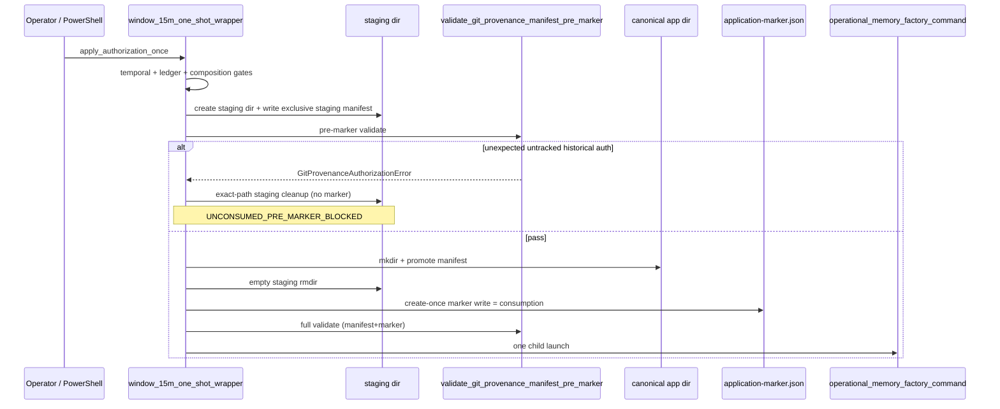
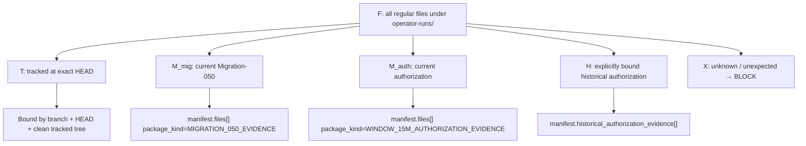
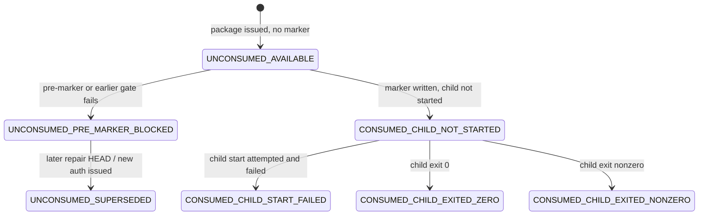

# Printer V1 V2-9.8B WINDOW_15M Historical Authorization Evidence Contract Design

| Field | Value |
| --- | --- |
| Document title | V2-9.8B WINDOW_15M Historical Authorization Evidence Contract Design |
| Author | Codex / Grok Build design lane |
| Date | 2026-08-06 |
| Status | Approved design (`DESIGN_PASS`) |
| Lane type | design/specification only |
| Design branch baseline | `agent/v2-9-8b-window-15m-fresh-authorization-after-orientation-repair` |
| Required full HEAD | `ef19f25489a01d86387bc55cb98a128601cdb036` |
| Proposed final repo path | `docs/printer-v1-v2-9-8b-window-15m-historical-authorization-evidence-contract-design.md` |
| Revision | R1 — addresses design review issues 1–13 |

## 1. Verdict

`V2_9_8B_WINDOW_15M_HISTORICAL_AUTHORIZATION_EVIDENCE_CONTRACT_DESIGN_PASS`

A narrow, fail-closed contract is approved that permits **preserved historical authorization evidence** to remain on disk as untracked regular files without weakening repository provenance validation.

The contract extends the current-vs-historical `operator-runs/` trust boundary from a two-class model (tracked history + current manifest) to a four-class model:

1. current Migration-050 evidence;
2. current WINDOW_15M authorization evidence;
3. explicitly bound historical WINDOW_15M authorization evidence;
4. tracked historical `operator-runs/` evidence;

and rejects every unknown, modified, additional, missing, symlinked, non-regular, or wildcard-classified path.

This design does **not** implement the repair, create a fresh authorization, write an application marker, contact providers, run Source Governor or Central Scheduler, execute a campaign, mutate the authoritative database, generate memory, activate retrieval, or unlock any paper-trading capability.

When this design is promoted into the repository, freeze it at:

`docs/printer-v1-v2-9-8b-window-15m-historical-authorization-evidence-contract-design.md`

with Status remaining `Approved design (`DESIGN_PASS`)` until a later superseding design is explicitly adopted.

## 2. Overview

### 2.1 Problem

Two manual operator invocations of the one-shot wrapper against authorization

`V2_9_8B_WINDOW_15M_AUTH_20260806T005252Z`

both failed before application-marker creation with:

```text
GitProvenanceAuthorizationError:
unexpected untracked repository file not covered by manifest:
operator-runs/v2-9-8b-window-15m-final-authorization/V2_9_8B_WINDOW_15M_AUTH_20260805T224959Z/final_authorization.json
```

That single path is the observed first failure string. It is **not** a claim that the authorization root contains only one historical file. The authorization root holds many package directories, some multi-file (reports, binding inventories, sha256 sidecars, application evidence). Any untracked regular file under any non-current package directory that is not bound in `H` will fail the same gate. The next real workspace after repair will therefore require `H` to bind **every** remaining untracked historical-authorization regular file, or pre-marker will block on a different residual path. `|H|` may be large until optional historical rollover moves old packages into `T`.

No child command, discovery, provider, Scheduler, campaign, or memory path started. Staging residue may remain under the external application root; the authorization package itself remains unconsumed at the marker boundary and is dispositioned:

```text
V2_9_8B_WINDOW_15M_AUTH_20260806T005252Z = BLOCKED_UNCONSUMED_SUPERSEDED
```

It must not be reused, edited, or deleted after this repair, because the repair will produce a different HEAD.

### 2.2 Proposed solution

Introduce one exact production owner that enumerates preserved historical authorization packages as exact regular-file records (path, size, SHA-256, evidence class, authorization ID, terminal disposition where available), bind those records in a separately keyed historical-evidence section of the external Git-provenance manifest, and require complete `operator-runs/` inventory equality against:

```text
complete inventory
=
tracked historical evidence
+ current Migration-050 evidence
+ current authorization evidence
+ explicitly bound historical authorization evidence
```

Authorization preparation must run the same production pre-marker reconciliation against the live repository so a preparation PASS cannot exist when the wrapper would immediately reject the workspace. Consumption is redefined to the create-once marker write. Pre-marker failures perform deterministic staging cleanup without implying consumption.

## 3. Controlling source stack

Active Printer V1 source stack:

- `AGENTS.md`
- `docs/printer-v1-clean-master-spec.md`
- `docs/printer-v1-post-rc-build-order.md`
- `docs/printer-v1-memory-factory-guide.md`
- `docs/printer-v1-current-state-memory-growth-audit.md`
- `docs/printer-v1-memory-growth-build-order-v2.md`

Also governing this lane:

- `docs/printer-v1-python-builder-guide.md`
- `docs/printer-v1-v2-9-8b-window-15m-source-specific-admission-retained-evidence-repair-closeout.md`
- `docs/printer-v1-v2-9-8b-window-15m-exact-market-member-binding-repair-closeout.md`
- `docs/printer-v1-v2-9-8b-window-15m-dexscreener-orientation-binding-repair-closeout.md`
- `docs/printer-v1-v2-9-8b-window-15m-fresh-authorization-after-orientation-repair-closeout.md`
- `docs/printer-v1-v2-9-8b-window-15m-current-vs-historical-operator-runs-trust-boundary-repair-design.md`
- `docs/printer-v1-v2-9-8b-window-15m-current-vs-historical-operator-runs-trust-boundary-repair-implementation.md`
- `docs/printer-v1-v2-9-8b-window-15m-current-vs-historical-operator-runs-trust-boundary-repair-independent-closeout.md`
- `docs/printer-v1-v2-9-8b-window-15m-external-one-shot-wrapper-manifest-application-marker-design.md`
- `docs/printer-v1-v2-9-8b-window-15m-current-evidence-historical-rollover-design.md` (historical precedent; not the chosen exclusive mechanism here)
- `docs/printer-v1-v2-9-8b-window-15m-authorization-retention-integration-repair-closeout.md`

Required V2 progression remains:

`audit/readiness -> design/specification -> implementation -> bounded proof/test -> closeout report`

## 4. Baseline and blocked packages

| Item | Value |
| --- | --- |
| Required branch | `agent/v2-9-8b-window-15m-fresh-authorization-after-orientation-repair` |
| Required full HEAD | `ef19f25489a01d86387bc55cb98a128601cdb036` |
| Blocked authorization | `V2_9_8B_WINDOW_15M_AUTH_20260806T005252Z` |
| Blocked package | `operator-runs/v2-9-8b-window-15m-final-authorization/V2_9_8B_WINDOW_15M_AUTH_20260806T005252Z/final_authorization.json` |
| Prior preserved authorization named by blocker | `operator-runs/v2-9-8b-window-15m-final-authorization/V2_9_8B_WINDOW_15M_AUTH_20260805T224959Z/final_authorization.json` |
| Controlling audit conclusion | `COMMITTED_CODE_DEFECT` |
| Current authorization disposition | `BLOCKED_UNCONSUMED_SUPERSEDED` |
| Prior authorization disposition | permanently consumed and preserved |
| Child / discovery / provider / Scheduler / campaign / memory | none started |
| Manual invocations reaching same pre-marker block | 2 |

Blocked package facts (read-only; **do not edit** these bytes):

- schema `PRINTER_V1_WINDOW_15M_FINAL_AUTHORIZATION_V2`
- authorized HEAD `ef19f25489a01d86387bc55cb98a128601cdb036`
- migration execution `V2_9_8B_AUTHORITATIVE_MIG050_20260801T202423Z_f697cc0f`
- `consumption_law.consumed_when` currently records `"wrapper_execution_begins"` (incorrect relative to intended marker law; corrected for **future** packages only by this design)
- `consumption_law.consumed_regardless_of` currently includes `"block"` (incorrect for pre-marker blocks; corrected for **future** packages only)
- `honest_terminal_law.authorization_consumed_by_blocked_attempt` currently `true` (incorrect when no marker exists; corrected for **future** packages only)
- `prior_authorizations_non_reusable` includes `V2_9_8B_WINDOW_15M_AUTH_20260805T224959Z`

## 5. Exact root cause

### 5.1 Classification

`COMMITTED_CODE_DEFECT` in the Git-provenance authorization manifest boundary and wrapper manifest builder.

This is **not**:

- an operator procedure-only failure after the fresh authorization was issued on HEAD `ef19f254…`;
- a false positive of the unexpected-untracked gate;
- a Source Governor, Central Scheduler, discovery, or memory defect;
- a reason to delete, move, or commit-absorb the blocked package into the current HEAD as a silent fix.

### 5.2 Mechanism

The current production model (post current-vs-historical trust-boundary repair) requires:

```text
F == T ∪ M
```

where:

| Symbol | Derivation | Owner |
| --- | --- | --- |
| `F` | every regular file under `operator-runs/` | `_inventory_operator_runs` |
| `T` | tracked `operator-runs/` paths at exact HEAD | `_tracked_operator_runs_paths` via `git ls-tree -r --name-only -z HEAD -- operator-runs/` |
| `M` | external manifest `files[]` paths | wrapper `build_manifest_bytes` + validator `_validate_files` |
| `V` | whole-repo visible untracked | `git ls-files --others --exclude-standard -z` |
| `I` | ignored untracked under `operator-runs/` | `git ls-files --others --ignored --exclude-standard -z -- operator-runs/` |
| `C` | filesystem files under the two current package roots | derived from `F` |

`build_manifest_bytes` in `src/printer_v1/operator_cli/window_15m_one_shot_wrapper.py` enumerates **exactly two** package roots:

1. `operator-runs/v2-9-8b-authoritative-mig050/<migration_execution_id>/` → `MIGRATION_050_EVIDENCE`
2. `operator-runs/v2-9-8b-window-15m-final-authorization/<current_authorization_id>/` → `WINDOW_15M_AUTHORIZATION_EVIDENCE`

It has no path to bind a **third** class: preserved untracked historical authorization packages that remain lawfully on disk after a consumed prior run (and after deliberate non-deletion policy), but were **not** rolled into Git-tracked history.

The validator then fails closed at `_reconcile_evidence_sets`:

```text
unexpected_visible = V_effective − M
```

for the prior package file first observed as:

```text
operator-runs/v2-9-8b-window-15m-final-authorization/V2_9_8B_WINDOW_15M_AUTH_20260805T224959Z/final_authorization.json
```

Any other untracked regular file under any other historical package directory would fail the same way if it were the residual set member not covered by `M`.

### 5.3 Why the prior trust-boundary repair did not solve this

The current-vs-historical trust-boundary repair correctly separated:

- **tracked historical** files bound by exact Git HEAD (`T`);
- **current untracked** files bound by the external manifest (`M`).

It intentionally rejected “visible untracked historical-looking files outside current roots” (design negative case 6). That is correct for unknown residue. It is incorrect for **deliberately preserved untracked historical authorization packages** that authorization closeouts treat as lawful retained evidence and that historical-rollover only sometimes converts into `T`.

Repeated historical rollover (tracking every consumed package before the next authorization) is a valid **alternative process**, but:

- it was not executed for `…20260805T224959Z` before issuing `…20260806T005252Z`;
- the fresh-authorization closeout itself declared “only lawful untracked Migration-050 and prior authorization evidence” while the production builder still bound only Migration-050 + **current** package;
- forcing every intermediate package into Git creates HEAD churn and still leaves a code gap whenever any preserved untracked package remains.

Therefore the durable product contract must allow an explicit, exact-file historical-authorization binding class rather than depending on rollover alone.

### 5.4 Secondary contract defects exposed by the same incident

1. **Consumption wording drift.** Package/closeout text says `consumed_when: "wrapper_execution_begins"`, and also asserts consumption “regardless of block” and `authorization_consumed_by_blocked_attempt = true`. The external wrapper design and code path treat create-once marker write as the durable consumption event. Pre-marker blocks leave the package technically unconsumed.
2. **Preparation parity gap.** Authorization preparation measured DB identity and evidence digests but did not run the production pre-marker inventory reconciliation against the live untracked historical package set, so preparation PASS co-existed with immediate wrapper rejection.
3. **Pre-marker staging cleanup gap.** On pre-marker failure, `apply_authorization_once` may leave the invocation-specific staging directory under `APPLICATION_ROOT/.staging/` without deterministic cleanup, while post-success empty staging removal already exists.

## 6. Background & Motivation

### 6.1 Current state (HEAD `ef19f254…`)

Canonical production modules:

| Module | Role |
| --- | --- |
| `scripts/Start-PrinterV1-Window15M-OneShot.ps1` | public entry; no manifest/marker construction |
| `src/printer_v1/operator_cli/window_15m_one_shot_wrapper.py` | one-shot owner: build manifest, stage, pre-marker validate, publish, write marker, launch one child |
| `src/printer_v1/operator_cli/git_provenance_authorization_manifest.py` | external manifest/marker schema + complete `operator-runs/` reconciliation |
| `src/printer_v1/operator_cli/git_provenance.py` | launch-time six-field provenance; exact `allowed_untracked_paths` |
| `src/printer_v1/operator_cli/operational_memory_factory_command.py` | child ordinary `run --operator-approved` owner |

Relevant constants and functions at baseline:

```text
MANIFEST_SCHEMA_VERSION = "PRINTER_V1_GIT_PROVENANCE_MANIFEST_V1"
APPLICATION_MARKER_SCHEMA_VERSION = "PRINTER_V1_APPLICATION_MARKER_V1"
MIGRATION_PACKAGE_KIND = "MIGRATION_050_EVIDENCE"
AUTHORIZATION_PACKAGE_KIND = "WINDOW_15M_AUTHORIZATION_EVIDENCE"
AUTHORIZATION_PACKAGE_ROOT = "operator-runs/v2-9-8b-window-15m-final-authorization"
MIGRATION_PACKAGE_ROOT = "operator-runs/v2-9-8b-authoritative-mig050"

build_manifest_bytes(...)
validate_git_provenance_manifest_pre_marker(...)
validate_git_provenance_authorization(...)
_reconcile_evidence_sets(...)
compute_allowed_file_set_sha256(...)
apply_authorization_once(...)
capture_git_provenance(..., allowed_untracked_paths=...)
```

Pre-marker flow inside `apply_authorization_once` (simplified; post-repair cleanup control-flow is specified in §14):



### 6.2 Pain points

- Scarce one-use authorizations can be blocked after packaging by a deterministic inventory defect.
- Preserving historical authorization evidence (correct audit policy) conflicts with the two-class inventory invariant unless every package is Git-tracked first.
- Operators cannot trust preparation PASS as a predictor of wrapper pre-marker PASS.
- Closeout/package wording overstates consumption on wrapper process start, creating operational confusion about reuse of pre-marker-blocked packages.

### 6.3 Money-usefulness contribution

Printer’s only remaining path to useful paper-only `WINDOW_15M` memory growth on this stack is one lawful ordinary campaign through the one-shot wrapper. Each wasted authorization attempt delays corpus growth without creating clean memory, decisions, or PnL. This repair restores the inventory contract so a correctly prepared exact-HEAD authorization can pass pre-marker validation while historical packages remain preserved and non-reusable. It creates no market signal, retrieval result, decision, position, trade, or profit claim.

## 7. Goals & Non-Goals

### 7.1 Goals

1. Permit preserved historical WINDOW_15M authorization packages as exact-file-bound untracked evidence.
2. Keep complete `operator-runs/` inventory fail-closed.
3. Keep current Migration-050 and current authorization packages exact and untracked.
4. Keep tracked historical evidence bound only by exact Git HEAD.
5. Make authorization preparation run production pre-marker reconciliation without consumption side effects.
6. Define marker-based consumption states and reuse law.
7. Define deterministic pre-marker staging cleanup.
8. Record disposition of the blocked and prior packages.
9. Specify the narrowest implementation boundary and disposable proofs.

### 7.2 Non-Goals

- Reusing `V2_9_8B_WINDOW_15M_AUTH_20260806T005252Z` or `…20260805T224959Z`.
- Deleting, relocating, or silently rewriting either package.
- Implementing this repair in the design lane.
- Issuing a fresh authorization in this lane.
- Historical rollover commits as the **only** solution (rollover remains optional later process).
- Discovery, candidate admission, memory generation, Scheduler, Source Governor, schema migration, or database changes.
- Retrieval, paper decisions, BUY/SELL/HOLD, positions, trades, audits, PnL, wallets, private keys, paid APIs, scoring, ranking, confidence, weighting, embeddings, or vectors.
- Changing `.gitignore` to hide historical authorization packages.
- Wildcard, directory-only, or “allow everything under authorization root” rules.
- A disposition registry, disposition database, or runtime reuse authority derived from `terminal_disposition` strings.

## 8. Current versus historical evidence model

### 8.1 Five filesystem / Git sets (retained)

| Set | Symbol | Meaning |
| --- | --- | --- |
| Complete inventory | `F` | every regular file under `operator-runs/` |
| Tracked historical | `T` | `operator-runs/` paths tracked at authorized HEAD |
| Visible untracked | `V` | whole-repo visible untracked paths |
| Ignored untracked (scoped) | `I` | ignored untracked under `operator-runs/` |
| Effective visible | `V_eff` | `V` minus fixed runtime sidecars only |

### 8.2 Four evidence classes (new product model)

| Class | Symbol | Trust binding | Returned in `allowed_untracked_paths`? |
| --- | --- | --- | --- |
| Current Migration-050 | `M_mig` | manifest `files[]` with `MIGRATION_050_EVIDENCE` under exact migration execution root | yes |
| Current authorization | `M_auth` | manifest `files[]` with `WINDOW_15M_AUTHORIZATION_EVIDENCE` under exact current authorization root | yes |
| Explicit historical authorization | `H` | manifest `historical_authorization_evidence[]` exact path/size/hash under authorization root, not current ID | yes |
| Tracked historical operator-runs | `T` | exact HEAD tree; not listed in current or historical untracked sections | **no** |

Define:

```text
M = M_mig ∪ M_auth          # current-only manifest files[]
U = M ∪ H                   # complete untracked allowlist
C = files in F under the two current package roots
```

### 8.3 Complete inventory invariant

```text
F == T ∪ M ∪ H
```

Equivalently:

```text
complete inventory
=
tracked historical evidence
+ current Migration-050 evidence
+ current authorization evidence
+ explicitly bound historical authorization evidence
```

Disjointness requirements:

```text
T ∩ U = ∅
M_mig ∩ M_auth = ∅
H ∩ M = ∅
H ∩ T = ∅
T ∩ C = ∅
C == M
```

**Critical split (implementation footgun prevention):**

- `M` is **current-only**. It is the only set used for current-package equality (`C == M`).
- `U = M ∪ H` is the **untracked allowlist** used for visible/ignored surprise checks and for `allowed_untracked_paths`.
- Never pass `U` into today’s single `manifest_paths` parameter without splitting the checks; that would make historical paths fail `missing_current` because `H ⊄ C`.

No other file may be accepted.

### 8.4 Classification diagram



## 9. Historical authorization evidence owner

### 9.1 Canonical owner

**Canonical owner name:** `enumerate_historical_authorization_evidence`

**Canonical module:** `src/printer_v1/operator_cli/git_provenance_authorization_manifest.py`

Rationale:

- the same module already owns package-kind constants, path normalization, inventory, and `_reconcile_evidence_sets`;
- keeping enumeration and validation co-located prevents preparation/wrapper drift;
- the wrapper’s `build_manifest_bytes` becomes a caller, not a second owner;
- authorization preparation becomes a caller of the same function and the same pre-marker validator.

Public surface (implementation may keep helpers private if tests import via package `__all__` deliberately):

```python
HISTORICAL_AUTHORIZATION_EVIDENCE_CLASS = (
    "HISTORICAL_WINDOW_15M_AUTHORIZATION_EVIDENCE"
)

def enumerate_historical_authorization_evidence(
    *,
    repository_root: str | Path,
    current_authorization_id: str,
    tracked_operator_runs_paths: set[str] | None = None,
    git_executable: str = "git",
    timeout_seconds: float = GIT_COMMAND_TIMEOUT_SECONDS,
    runner: Callable[..., Any] = subprocess.run,
) -> tuple[dict[str, Any], ...]:
    """Return exact historical authorization file records (sorted by path)."""
```

### 9.2 Exact enumeration algorithm

Inputs:

- repository root;
- current authorization ID (never historical);
- optional precomputed `T` (or compute via existing `_tracked_operator_runs_paths`).

Steps:

1. Reject if `operator-runs/` is missing, a symlink, or not a directory (existing law).
2. Reject if `AUTHORIZATION_PACKAGE_ROOT` is a symlink.
3. Scan only immediate package directories under:

   `operator-runs/v2-9-8b-window-15m-final-authorization/`

   Package directory names must match the safe identifier law already used by the wrapper (`^[A-Za-z0-9_.-]+$`). Unknown directory shapes block.
4. For each package directory `auth_id`:
   - if `auth_id == current_authorization_id`: skip (current package is owned by `files[]`);
   - recursively inventory **every** regular file under that package (no follow symlinks; non-regular blocks; symlink blocks) — multi-file packages must emit one `H` record per untracked regular file (reports, sidecars, inventories, JSON, text, etc.);
   - for each regular file path `p`:
     - if `p ∈ T`: classify as tracked historical; **do not** emit an `H` record;
     - if `p ∉ T`: emit one historical record (untracked preserved historical authorization evidence).
5. Sort emitted records by `path` ascending.
6. Reject duplicates by path.
7. Empty historical package directories that contain no regular files do **not** block (existing inventory walks files only). The incomplete empty package `…20260804T014448Z` remains harmless if empty.
8. Terminal disposition resolution is diagnostic only (see §9.5 mapping table). Default `DISPOSITION_NOT_AVAILABLE`. Never invent success. Disposition is **not** reuse authority.

9. Authorization preparation and wrapper **must both call this owner**. Neither may invent a parallel scan.

### 9.3 Exact record shape

Each historical evidence record is a JSON object with **exact keys** (no extras, no missing):

```json
{
  "path": "operator-runs/v2-9-8b-window-15m-final-authorization/V2_9_8B_WINDOW_15M_AUTH_20260805T224959Z/final_authorization.json",
  "sha256": "<64 lowercase hex>",
  "size": 12345,
  "evidence_class": "HISTORICAL_WINDOW_15M_AUTHORIZATION_EVIDENCE",
  "authorization_id": "V2_9_8B_WINDOW_15M_AUTH_20260805T224959Z",
  "terminal_disposition": "CONSUMED_CHILD_EXITED_NONZERO"
}
```

Field law:

| Field | Rule |
| --- | --- |
| `path` | repository-relative POSIX; no `\`, no `..`, no empty/`.` segments, no trailing `/`, no glob chars `* ? [` |
| `sha256` | lowercase 64-hex; must match filesystem bytes |
| `size` | non-negative int (not bool); must match filesystem |
| `evidence_class` | exactly `HISTORICAL_WINDOW_15M_AUTHORIZATION_EVIDENCE` |
| `authorization_id` | safe identifier; must equal the package directory segment of `path` |
| `terminal_disposition` | non-empty string; one of the approved vocabulary below |

Approved `terminal_disposition` vocabulary:

```text
CONSUMED_CHILD_EXITED_ZERO
CONSUMED_CHILD_EXITED_NONZERO
CONSUMED_CHILD_START_FAILED
CONSUMED_CHILD_NOT_STARTED
BLOCKED_UNCONSUMED_SUPERSEDED
PERMANENTLY_CONSUMED_PRESERVED
DISPOSITION_NOT_AVAILABLE
```

### 9.4 Hard rejects for the owner and validator

The owner/validator must block when:

- a historical path is outside `AUTHORIZATION_PACKAGE_ROOT/`;
- a historical path is under the current authorization package root;
- `authorization_id` equals the current authorization ID;
- `authorization_id` does not match the path package segment;
- a historical path is tracked at HEAD (`H ∩ T ≠ ∅`);
- path/size/hash mismatch vs filesystem;
- symlink file or parent component;
- non-regular file;
- duplicate path across `files[]` and historical section or within either;
- wildcard/directory-only/prefix allow rules appear in schema or code;
- unknown package directory under the authorization root contains untracked files not emitted into `H` (completeness: untracked files under authorization root that are neither current nor listed in `H` always block at reconciliation even if owner bugs).

### 9.5 Artifact → `terminal_disposition` mapping table

Exactly one vocabulary member per historical `authorization_id` (applied to every `H` row for that ID). Evaluation order is top-down; first match wins. Never invent `PERMANENTLY_CONSUMED_PRESERVED` or `BLOCKED_UNCONSUMED_SUPERSEDED` from runtime artifacts alone.

| Priority | Observed artifacts (local filesystem only) | Disposition |
| ---: | --- | --- |
| 1 | Named policy assignment in an approved closeout/design for this exact ID (e.g. this design assigns `…005252Z → BLOCKED_UNCONSUMED_SUPERSEDED`, `…224959Z → PERMANENTLY_CONSUMED_PRESERVED`) | that assigned value |
| 2 | External `APPLICATION_ROOT/<auth_id>/application-marker.json` exists **and** `wrapper-terminal.json` has `terminal_classification` / child exit | map wrapper terminal: |
| 2a | … `CHILD_EXITED_ZERO` or `terminal_classification == "CHILD_EXITED_ZERO"` / `child_exit_code == 0` | `CONSUMED_CHILD_EXITED_ZERO` |
| 2b | … nonzero exit recorded | `CONSUMED_CHILD_EXITED_NONZERO` |
| 2c | … `CONSUMED_CHILD_START_FAILED` or process_start_error with child_start_attempted true | `CONSUMED_CHILD_START_FAILED` |
| 2d | … marker exists, no successful child start (including `CONSUMED_CHILD_NOT_STARTED`) | `CONSUMED_CHILD_NOT_STARTED` |
| 3 | Marker exists but terminal unreadable/malformed | `CONSUMED_CHILD_NOT_STARTED` |
| 4 | No marker; package-local `application_started.json` / `campaign_exit.json` / `terminal_evidence.json` clearly show a prior application attempt that consumed under older operator law | still **not** auto-`PERMANENTLY_CONSUMED_PRESERVED`; use `DISPOSITION_NOT_AVAILABLE` unless priority-1 policy names the ID |
| 5 | Otherwise | `DISPOSITION_NOT_AVAILABLE` |

Rules:

- Disposition is diagnostic metadata only. It never authorizes reuse, never satisfies `_resolve_authorization`, and never substitutes for exact HEAD/branch matching.
- `PERMANENTLY_CONSUMED_PRESERVED` and `BLOCKED_UNCONSUMED_SUPERSEDED` are **policy labels** assigned by closeout/design for named IDs (priority 1), not free inference from partial residue.
- Wrapper runtime terminal strings (`CHILD_EXITED_ZERO`, etc.) map into the vocabulary above for historical rows when priority 2 applies; do not invent a second vocabulary in prep summaries.

## 10. Manifest / schema decision

### 10.1 Decision

**Add a separately bound historical-evidence section.** Do **not** place historical files into the current authorization package directory. Do **not** rely solely on extending `package_kind` inside `files[]` as the only vehicle, because that would break the existing invariant `C == M` (current package inventory equals current `files[]`) and would force heterogeneous entry key sets for disposition metadata.

Chosen schema version:

```text
PRINTER_V1_GIT_PROVENANCE_MANIFEST_V2
```

Marker schema remains:

```text
PRINTER_V1_APPLICATION_MARKER_V1
```

(marker fields unchanged; it continues to bind `manifest_sha256` and `allowed_file_set_sha256`).

### 10.2 Manifest V2 exact top-level keys

```text
schema_version
authorization_id
authorization_file
repository
authorized_command
migration_execution_id
created_at
files
historical_authorization_evidence
```

`historical_authorization_evidence` is a **required** array (may be empty when no untracked historical authorization files exist).

`files` retains the current entry schema and package kinds only:

```text
path, sha256, size, package_kind ∈ {MIGRATION_050_EVIDENCE, WINDOW_15M_AUTHORIZATION_EVIDENCE}
```

### 10.3 Compatibility with digests, allowlists, and `file_count`

Allowed-file-set digest law (deterministic, path-sorted):

1. Map each `files[]` entry to:

   `{package_kind, path, sha256, size}`

2. Map each historical entry to:

   `{package_kind: evidence_class, path, sha256, size}`

   i.e. `package_kind = "HISTORICAL_WINDOW_15M_AUTHORIZATION_EVIDENCE"`.

3. Union the two lists, sort by `path`, JSON-canonicalize with the existing algorithm in `compute_allowed_file_set_sha256`, SHA-256 the ASCII bytes.

4. Marker `allowed_file_set_sha256` binds that digest over the **union** `M ∪ H`.

`PreparedGitProvenanceAuthorization.allowed_untracked_paths` / `ValidatedGitProvenanceAuthorization.allowed_untracked_paths` become:

```text
tuple(sorted(paths(M) ∪ paths(H)))
```

so `capture_git_provenance(..., allowed_untracked_paths=...)` continues to treat historical untracked authorization files as allowed companions and still fails on any other untracked path.

**`file_count` / `allowed_file_count` semantics:**

```text
file_count = |M ∪ H| = len(allowed_untracked_paths)
```

This is the allowlist size bound into prep/wrapper summaries that surface `file_count` / `allowed_file_count` today. It is **not** “current evidence only.”

Operator-facing prep parity summaries **must** print separate counts to avoid confusion:

```text
tracked_historical_count   = |T|
current_manifest_count     = |M|
historical_authorization_count = |H|
complete_inventory_count   = |F|
allowed_untracked_count    = |M ∪ H|   # equals file_count
```

Disposition and authorization_id are **not** part of the allowlist digest (they are bound in the manifest body and covered by `manifest_sha256`).

### 10.4 Validator changes to `_validate_files` / new `_validate_historical_authorization_evidence`

- Keep `_validate_files` for current `files[]` only; package roots remain the two current identities.
- Add `_validate_historical_authorization_evidence(manifest, *, root, current_authorization_id, tracked_paths)` that:
  - requires exact historical entry keys;
  - validates each file on disk (size/hash/regular/no symlink);
  - enforces path under `AUTHORIZATION_PACKAGE_ROOT/<other_id>/`;
  - rejects current ID;
  - rejects tracked paths;
  - rejects duplicates with `files[]`.

### 10.5 Reconciliation — required signature and check-by-check rewrite

**Do not** continue to overload a single `manifest_paths` set for both untracked allowlist and current-package equality. That is the primary implementation footgun: passing `M ∪ H` as today’s `manifest_paths` makes historical paths fail `missing_current` because they are outside the two current package roots.

#### 10.5.1 New function signature

```python
def _reconcile_evidence_sets(
    *,
    current_manifest_paths: set[str],      # M only (files[])
    historical_paths: set[str],            # H only
    visible_paths: set[str],
    ignored_paths: set[str],
    tracked_paths: set[str],               # T
    inventory_paths: set[str],             # F
    current_package_roots: tuple[str, str],
    sidecar_untracked_paths: Iterable[str],
) -> None:
    ...
```

Internal aliases:

```text
M = current_manifest_paths
H = historical_paths
U = M ∪ H
T = tracked_paths
F = inventory_paths
C = { p ∈ F | p is under either current package root }
V_eff = visible_paths − sidecars
I = ignored_paths
```

#### 10.5.2 Check-by-check mapping (old body → new expression)

| # | Current production check (conceptual) | Required repaired expression | Set used |
| ---: | --- | --- | --- |
| 1 | classification overlaps among T / V_eff / I | same; still fail on pairwise overlap | T, V_eff, I |
| 2 | `unexpected_visible = V_eff − manifest_paths` | `V_eff − U == ∅` | allowlist U |
| 3 | `unexpected_ignored = I − manifest_paths` | `I − U == ∅` | allowlist U |
| 4 | `tracked_manifest = T ∩ manifest_paths` | `T ∩ U == ∅` | allowlist U |
| 5 | tracked file inside current package roots | `T ∩ C == ∅` (unchanged meaning) | T, C |
| 6 | `missing_manifest = manifest_paths − F` | split: `(M − F == ∅)` and `(H − F == ∅)` | M, H, F |
| 7 | ignored outside inventory | `I − F == ∅` | I, F |
| 8 | tracked outside inventory | `T − F == ∅` | T, F |
| 9 | manifest neither visible nor ignored | `(M ∪ H) ⊆ (V_eff ∪ I)` | U |
| 10 | `missing_current = manifest_paths − C` | **`M − C == ∅` only** (never include H) | **M, C** |
| 11 | `unexpected_current = C − manifest_paths` | **`C − M == ∅` only** (never include H) | **C, M** |
| 12 | `C == M` package equality | `C == M` | **current only** |
| 13 | `expected_inventory = T ∪ manifest_paths` | `expected = T ∪ M ∪ H` | complete |
| 14 | `F == expected_inventory` | `F == T ∪ M ∪ H` | complete |
| 15 | (new) H location | no path in `H` under either current package root; equivalently `H ∩ C == ∅` | H, C |
| 16 | (new) H outside authorization root | already rejected in historical path validation | H |

#### 10.5.3 Forbidden incorrect implementation

```text
# FORBIDDEN — causes false missing_current on historical paths
manifest_paths = M ∪ H
missing_current = manifest_paths - current_inventory
```

```text
# REQUIRED
current_manifest_paths = M
historical_paths = H
missing_current = M - C
unexpected_current = C - M
unexpected_visible = V_eff - (M ∪ H)
expected_inventory = T | M | H
```

### 10.6 Schema snippet (illustrative)

```json
{
  "schema_version": "PRINTER_V1_GIT_PROVENANCE_MANIFEST_V2",
  "authorization_id": "V2_9_8B_WINDOW_15M_AUTH_NEWID",
  "authorization_file": {
    "path": "operator-runs/v2-9-8b-window-15m-final-authorization/V2_9_8B_WINDOW_15M_AUTH_NEWID/final_authorization.json",
    "sha256": "..."
  },
  "repository": {"branch": "...", "head": "..."},
  "authorized_command": {"mode": "run", "operator_approved": true},
  "migration_execution_id": "V2_9_8B_AUTHORITATIVE_MIG050_20260801T202423Z_f697cc0f",
  "created_at": "2026-08-06T12:00:00+00:00",
  "files": [
    {
      "path": "operator-runs/v2-9-8b-authoritative-mig050/.../preflight.json",
      "sha256": "...",
      "size": 18590,
      "package_kind": "MIGRATION_050_EVIDENCE"
    },
    {
      "path": "operator-runs/v2-9-8b-window-15m-final-authorization/V2_9_8B_WINDOW_15M_AUTH_NEWID/final_authorization.json",
      "sha256": "...",
      "size": 1,
      "package_kind": "WINDOW_15M_AUTHORIZATION_EVIDENCE"
    }
  ],
  "historical_authorization_evidence": [
    {
      "path": "operator-runs/v2-9-8b-window-15m-final-authorization/V2_9_8B_WINDOW_15M_AUTH_20260805T224959Z/final_authorization.json",
      "sha256": "...",
      "size": 1,
      "evidence_class": "HISTORICAL_WINDOW_15M_AUTHORIZATION_EVIDENCE",
      "authorization_id": "V2_9_8B_WINDOW_15M_AUTH_20260805T224959Z",
      "terminal_disposition": "PERMANENTLY_CONSUMED_PRESERVED"
    }
  ]
}
```

### 10.7 Schema rollout / no broken intermediate HEAD

`MANIFEST_SCHEMA_VERSION` is shared: the validator’s `_MANIFEST_KEYS` exact equality and the wrapper’s `build_manifest_bytes` both consume it.

**Hard merge law:**

- No intermediate published HEAD may leave the public one-shot path unable to build a valid production manifest.
- Production constant flip to V2, required `historical_authorization_evidence` key, builder emission of that key, and reconciliation that accepts `H` **must land in the same merge unit** (see PR Plan: PR1+PR2 atomic).
- Disposable unit tests may construct V2 manifests directly without the wrapper.
- Temporary dual acceptance of V1-with-implied-empty-`H` is **not** required for production if PR1+PR2 merge atomically; if an implementer temporarily needs dual acceptance during a long-running branch, it must be private to unmerged commits and never published as a green mainline HEAD with V2 validator + V1 builder.

## 11. Complete inventory reconciliation behaviors

| Scenario | Required behavior |
| --- | --- |
| Unknown historical package (untracked files under authorization root not listed in `H` and not current) | **BLOCK** — unexplained inventory / unexpected untracked |
| Multi-file historical package with one file omitted from `H` | **BLOCK** |
| Multiple historical `auth_id` dirs with any unbound untracked file | **BLOCK** |
| Altered historical file (size or SHA-256 drift vs `H`) | **BLOCK** — hash/size mismatch on direct validation |
| Missing historical file listed in `H` | **BLOCK** — missing or not a regular file |
| Empty historical package directory (no regular files) | **PASS** (not in `F`); no `H` rows required |
| Ignored SQLite evidence (Migration-050 `.sqlite3`) | remains in `M` / `I`; still required in current `files[]`; historical auth files are not ignore-exempted by class |
| Visible untracked non-evidence (e.g. `.DS_Store`, random file) | **BLOCK** — unexpected untracked |
| Tracked evidence unexpectedly inside a current package | **BLOCK** — tracked file exists inside a current evidence package |
| Duplicate evidence identities (same path twice in `files`/`H` or both) | **BLOCK** — duplicate path |
| Historical record claiming current authorization ID | **BLOCK** |
| Historical path outside authorization package root | **BLOCK** |
| Tracked historical file also listed in `H` | **BLOCK** — classification overlap |
| Historical file becomes tracked without removing from `H` | **BLOCK** |
| Mix: some files under authorization root in `T`, others untracked in `H` | **PASS** if every file is exactly one of T/M/H |
| New untracked historical package appears after manifest built | **BLOCK** at pre-marker or full validation |
| Wildcard / directory allow attempt | **BLOCK** at schema/path validation (impossible by contract) |

## 12. Authorization preparation parity

### 12.1 Goal

A preparation PASS must be impossible if the production pre-marker validator would immediately reject the same workspace for the inventory/manifest boundary.

**Scope honesty:** inventory/pre-marker parity is mandatory and is the defect that blocked this incident. Full `apply_authorization_once` readiness also includes earlier non-consuming gates (temporal validity, migration-ledger review, venv interpreter selection, source configuration, concrete composition). Those gates are **recommended** in the same prep function as non-consuming extras, but inventory parity alone must not be marketed as “full apply readiness.” Closeouts must state:

```text
inventory_pre_marker_parity_PASS ≠ full_apply_readiness_PASS
```

### 12.2 Canonical preparation function

Add:

```text
src/printer_v1/operator_cli/window_15m_authorization_preparation.py
```

or, if implementation prefers zero new modules, a clearly named public function in the wrapper module:

```python
def prepare_git_provenance_authorization_parity(
    *,
    repository_root: str | Path,
    authorization_file: str | Path,
    authorization_sha256: str,
    created_at: str | None = None,
) -> dict[str, Any]:
    ...
```

**Preferred:** dedicated preparation module importing production builders/validators only, to keep `apply_authorization_once` free of preparation CLI concerns. Prep may be merged in the same atomic unit as the wrapper builder (PR Plan) or as an immediately subsequent PR that cannot merge before the builder exists.

### 12.3 Non-consuming algorithm

1. Resolve and hash-check the authorization package with the same `_resolve_authorization` rules (path inside repo, no symlink components, exact package path, PASS verdict, WINDOW_15M, one-use flags).
2. **Recommended (non-consuming extras):** run temporal validity and migration-ledger `review` binding checks read-only. Report them as separate gate results in the prep summary. Do **not** require venv child interpreter selection or concrete composition for **inventory** parity PASS; if optionally included later, they remain non-consuming and must not write markers or application dirs.
3. **Mandatory:** build manifest bytes with production `build_manifest_bytes` (which must call `enumerate_historical_authorization_evidence`).
4. Write the manifest exclusively into a **temporary directory outside the repository and outside `APPLICATION_ROOT`** (e.g. `tempfile.TemporaryDirectory`), never into the canonical application tree.
5. Call production `validate_git_provenance_manifest_pre_marker` against that temp manifest path and SHA-256.
6. Return a filename-free summary including:
   - authorization_id, branch, head, PASS/BLOCK;
   - `tracked_historical_count`, `current_manifest_count`, `historical_authorization_count`, `complete_inventory_count`, `allowed_untracked_count` / `file_count`;
   - allowed_file_set_sha256, manifest_sha256;
   - optional separate temporal/ledger gate results when run.
7. Delete the temporary directory in `finally`.
8. **Never**:
   - write `application-marker.json`;
   - create `APPLICATION_ROOT/<authorization_id>/`;
   - launch a child;
   - contact providers;
   - open the authoritative DB for write (read-only ledger review only if already part of production gate);
   - mutate tracked Git state;
   - modify authorization package bytes;
   - consult a disposition registry as reuse authority.

### 12.4 Parity law

```text
prepare_parity uses build_manifest_bytes + validate_git_provenance_manifest_pre_marker
wrapper pre-marker uses build_manifest_bytes + validate_git_provenance_manifest_pre_marker
```

No alternate inventory math is allowed in preparation documents or scripts.

### 12.5 Relation to existing gates

- `evaluate_authorization_preparation_readiness_gate` remains optional readiness-artifact binding and is **not** a substitute for this parity check.
- Fresh authorization closeouts after this repair must require inventory preparation parity PASS before packaging claims readiness, and must separately list full apply readiness gates.

## 13. Marker-based consumption law

### 13.1 Corrected consumption event

Authorization consumption occurs when and only when the create-once application marker file is **successfully written** by `_write_exclusive` to:

```text
APPLICATION_ROOT/<authorization_id>/application-marker.json
```

Not when:

- the PowerShell process starts;
- the Python wrapper process starts;
- staging manifest is written;
- pre-marker validation runs;
- the canonical directory is created;
- the manifest is published;
- the child is launched.

This restores alignment with the external one-shot wrapper design (“create-once application marker as the authorization-consumption event”) and with code paths that leave packages unconsumed on pre-marker failure. It explicitly supersedes older operator practice that treated any wrapper start as consumed despite no marker (including historical post-rollover capture language).

### 13.2 State machine



### 13.3 State definitions

| State | Marker exists? | Meaning |
| --- | --- | --- |
| `UNCONSUMED_PRE_MARKER_BLOCKED` | no | Wrapper blocked at temporal/ledger/composition/staging/pre-marker before marker write |
| `CONSUMED_CHILD_NOT_STARTED` | yes | Marker written; child launch never attempted or not reached |
| `CONSUMED_CHILD_START_FAILED` | yes | Marker written; child start attempted and failed |
| `CONSUMED_CHILD_EXITED_NONZERO` | yes | Child ran and returned non-zero |
| `CONSUMED_CHILD_EXITED_ZERO` | yes | Child ran and returned zero (not automatically a memory PASS) |

### 13.4 Reuse law

| State | Technical reuse under same package ID? | Practical reuse after this incident? |
| --- | --- | --- |
| `UNCONSUMED_PRE_MARKER_BLOCKED` | technically possible only if package still exact-HEAD-valid and no supersession | **forbidden** for `…20260806T005252Z` because disposition is `BLOCKED_UNCONSUMED_SUPERSEDED` and repair changes HEAD |
| All `CONSUMED_*` | **never** | never |
| Any historical ID | **never** | never |

Supersession rule (policy + HEAD law, **not** a disposition-registry runtime feature):

```text
An authorization that is pre-marker blocked remains technically unconsumed
(no marker). It becomes non-reusable when:
  (a) its authorized_git.head no longer equals live HEAD (repair commit), or
  (b) a later closeout/design explicitly records BLOCKED_UNCONSUMED_SUPERSEDED
      for that ID, or
  (c) a later fresh authorization is issued.

Runtime enforcement of non-reuse is exact branch/HEAD/package binding and
_resolve_authorization identity — not a disposition database.
```

### 13.5 Future package / closeout wording (full field set)

**Do not edit** blocked packages `…005252Z` or `…224959Z`.

For **future** packages and closeouts only, require the full wording set below (not only `consumed_when`):

```json
"consumption_law": {
  "authorization_consumed_by_this_lane": false,
  "authorization_lane_must_not_create_manifest_or_marker": true,
  "automatic_successor_allowed": false,
  "concurrent_execution_allowed": false,
  "consumed_when": "create_once_application_marker_successfully_written",
  "consumed_regardless_of_after_marker": [
    "PASS",
    "child_block",
    "safe-stop",
    "interruption",
    "failure"
  ],
  "pre_marker_block_consumes_authorization": false,
  "wrapper_process_start_consumes_authorization": false,
  "permanently_non_reusable_after_marker": true,
  "rerun_allowed": false,
  "restart_allowed": false,
  "resume_allowed": false,
  "retry_allowed": false,
  "reuse_allowed": false,
  "second_execution_allowed": false,
  "wrapper_creates_manifest": true,
  "wrapper_creates_marker": true
}
```

And for honest terminal law:

```json
"honest_terminal_law": {
  "authorization_consumed_by_blocked_attempt": false,
  "authorization_consumed_only_if_application_marker_exists": true,
  "pre_marker_block_leaves_authorization_unconsumed": true,
  "superseded_unconsumed_packages_are_non_reusable": true,
  "clean_memory_guaranteed": false,
  "eligible_two_token_supply_guaranteed": false,
  "exit_code_zero_is_memory_pass": false,
  "memory_pass_requires_authoritative_completed_window_15m_and_clean_memory_rows": true,
  "provider_success_guaranteed": false
}
```

Field intent:

| Field | Rule |
| --- | --- |
| `consumed_when` | exactly marker create-once success |
| `pre_marker_block_consumes_authorization` | must be `false` |
| `wrapper_process_start_consumes_authorization` | must be `false` (supersedes older operator shorthand) |
| `consumed_regardless_of_after_marker` | post-marker outcomes only; **must not** list bare `"block"` as if pre-marker blocks consume |
| `authorization_consumed_by_blocked_attempt` | `false` unless a marker exists; prefer the explicit split fields above |
| supersession | named IDs such as `…005252Z` remain `BLOCKED_UNCONSUMED_SUPERSEDED` in closeouts |

Keep: no retry/rerun/resume/restart/successor under the same ID after consumption; no concurrent second execution.

## 14. Staging cleanup design

### 14.1 Staging identity

Each invocation creates exactly one staging directory:

```text
APPLICATION_ROOT / ".staging" / f"{authorization_id}-{uuid4.hex}"
```

Contents expected from production:

- `git-provenance-manifest.json` only (until promotion).

### 14.2 Required control-flow (try / finally)

Today staging is created **before** `build_manifest_bytes` and pre-marker validation; on success only empty `rmdir` runs; on failure the exception propagates and residue remains. The repair must specify the statement placement explicitly.

Pseudocode for `apply_authorization_once` after non-consuming gates (temporal, ledger, interpreter, composition) have already passed:

```text
staging_dir = None
canonical_published = False
marker_created = False
primary_error = None

try:
    staging_dir = APPLICATION_ROOT / ".staging" / f"{authorization_id}-{uuid4.hex}"
    staging_dir.mkdir(parents=True, exist_ok=False)          # fail site: mkdir race
    staging_manifest = staging_dir / "git-provenance-manifest.json"

    manifest_payload, manifest_bytes = build_manifest_bytes(...)  # fail site: build
    _write_exclusive(staging_manifest, manifest_bytes)            # fail site: write
    manifest_sha256 = sha256(manifest_bytes)

    prepared = pre_marker_validator(... staging_manifest ...)     # fail site: validate

    canonical_dir.mkdir(...)                                      # fail site: canonical mkdir
    os.replace(staging_manifest, canonical_manifest)              # promote
    canonical_published = True
    best_effort empty rmdir(staging_dir)

    write marker...                                               # consumption
    marker_created = True
    full validate + child launch...
except Exception as exc:
    primary_error = exc
    raise
finally:
    if staging_dir is not None and not canonical_published:
        cleanup_error = exact_path_staging_cleanup(staging_dir)
        # attach cleanup_error as secondary; never replace primary_error
        # never set consumption from cleanup
```

**Pre-publication failure sites that must hit cleanup when `canonical_published` is false:**

1. staging `mkdir` success then later failure (cleanup no-op or empty dir);
2. `build_manifest_bytes` failure after mkdir;
3. staging manifest `_write_exclusive` failure;
4. `validate_git_provenance_manifest_pre_marker` failure;
5. canonical `mkdir` failure after staging write;
6. `os.replace` promotion failure before `canonical_published` is set true.

Once `canonical_published` is true, do **not** run the pre-publication cleanup (manifest already left staging); use existing post-promotion empty `rmdir` only.

### 14.3 Exact-path cleanup requirements

When failure occurs before canonical publication:

1. Remove only the exact staging directory created by **that** invocation (path held in a local variable).
2. Allowed removal sequence (fail-closed, non-recursive wipe of unknown trees):
   - if staging path is not a directory → report cleanup failure, do not invent success;
   - if staging path is a symlink → **do not** follow or delete targets; report cleanup failure and preserve;
   - list entries with `os.scandir` (no follow);
   - every entry must be a regular file whose name is in the invocation’s allowlist (initially only `git-provenance-manifest.json`);
   - if any unexpected entry exists → **do not delete anything**; leave residue; report `STAGING_CLEANUP_BLOCKED_UNEXPECTED_ENTRY`;
   - otherwise unlink each known regular file, then `rmdir` the staging directory;
   - never `shutil.rmtree`;
   - never delete `APPLICATION_ROOT/<authorization_id>/` historical application evidence;
   - never delete sibling staging directories.
3. Preserve the original blocker as terminal authority. Cleanup exceptions are attached as secondary notes / separate fields (`cleanup_error`) and must not replace `GitProvenanceAuthorizationError` / first `OneShotWrapperError`.
4. Cleanup success or failure must not flip consumption: no marker ⇒ still unconsumed.
5. Wrapper stderr JSON should remain primary-blocker-first; cleanup status may appear as additional structured fields without changing exit-class meaning.

### 14.4 Post-promotion empty staging

Keep existing best-effort `staging_dir.rmdir()` after `os.replace` promotion. Non-empty residue after promotion remains non-recursive and non-consuming (existing tests `test_31` / `test_32`).

### 14.5 Existing residue from the two blocked invocations

Design-time handling (implementation/proof lane, not this design lane):

1. Inspect `~/PrinterOperations/v2-9-8/window-15m-one-shot-applications/.staging/` for directories whose names start with `V2_9_8B_WINDOW_15M_AUTH_20260806T005252Z-`.
2. Record path, mtime, entry listing, and hashes of any residual manifest files.
3. Compare residual manifest content to the blocked package identity (authorization_id, head) for attribution only.
4. Removal is permitted only when:
   - directory membership proves single-invocation ownership (name prefix + uuid suffix);
   - every entry is the known staging manifest regular file;
   - no marker exists for that authorization ID;
   - operator/proof lane explicitly authorizes residue cleanup.
5. Do not treat residue presence as consumption. Do not delete the authorization package under `operator-runs/`.

## 15. Existing authorization disposition

| Authorization ID | Disposition | Reuse | Edit/delete |
| --- | --- | --- | --- |
| `V2_9_8B_WINDOW_15M_AUTH_20260806T005252Z` | `BLOCKED_UNCONSUMED_SUPERSEDED` | **no** | **no** |
| `V2_9_8B_WINDOW_15M_AUTH_20260805T224959Z` | permanently consumed and preserved (`PERMANENTLY_CONSUMED_PRESERVED`) | **no** | **no** |

These are **priority-1 policy assignments** for §9.5 (not inferred solely from residue).

After the repair lands on a new HEAD, both packages become historical evidence class members for the next fresh authorization’s `H` set (unless a separately approved historical-rollover lane tracks them into `T` first). Tracking is optional; explicit `H` binding is mandatory if they remain untracked. The next real workspace must bind **all** remaining untracked regular files under **all** historical package directories, not only these two IDs’ primary JSON files.

## 16. Proposed design — wrapper builder changes

`build_manifest_bytes` must:

1. resolve current authorization (unchanged);
2. enumerate current Migration-050 package (unchanged);
3. enumerate current authorization package (unchanged);
4. call `enumerate_historical_authorization_evidence` for `H` (all untracked regular files under all non-current package dirs);
5. emit schema V2 payload including `historical_authorization_evidence`;
6. keep deterministic canonical JSON bytes (`sort_keys=True`, trailing newline) consistent with existing `_canonical_json_bytes`.

No historical file bytes are copied into the current package directory.

Because `build_manifest_bytes` imports `MANIFEST_SCHEMA_VERSION`, the builder change **must** ship in the same merge unit as the validator V2 key set (see §10.7 and PR Plan).

## 17. API / Interface Changes

### 17.1 New / changed Python APIs

| API | Change |
| --- | --- |
| `MANIFEST_SCHEMA_VERSION` | `..._V1` → `..._V2` (same merge unit as builder) |
| `HISTORICAL_AUTHORIZATION_EVIDENCE_CLASS` | new constant |
| `enumerate_historical_authorization_evidence(...)` | new owner |
| `compute_allowed_file_set_sha256` | accept union of current + historical digest records (or new wrapper that builds the union then calls existing helper) |
| `validate_git_provenance_manifest_pre_marker` | parse V2, validate `H`, reconcile with split `current_manifest_paths` / `historical_paths` |
| `validate_git_provenance_authorization` | inherits via pre-marker |
| `PreparedGitProvenanceAuthorization.file_count` | `|M ∪ H|` |
| `build_manifest_bytes` | emit V2 + historical section |
| `prepare_git_provenance_authorization_parity` | new non-consuming prep |
| `apply_authorization_once` | try/finally staging cleanup; marker remains consumption event |
| PowerShell entry | **unchanged** parameters |

### 17.2 Marker / env bindings

Unchanged four env vars:

```text
PRINTER_V1_GIT_PROVENANCE_MANIFEST_PATH
PRINTER_V1_GIT_PROVENANCE_MANIFEST_SHA256
PRINTER_V1_APPLICATION_MARKER_PATH
PRINTER_V1_APPLICATION_MARKER_SHA256
```

### 17.3 Authorization package schema

`PRINTER_V1_WINDOW_15M_FINAL_AUTHORIZATION_V2` package documents issued **after** this repair must use the full consumption-field set in §13.5. The blocked package is not edited.

## 18. Data Model Changes

- No SQLite schema migration.
- No database mutation.
- External application artifact schemas: marker V1 unchanged; manifest V2 additive section only.
- Repository `operator-runs/` layout unchanged (no moves).
- No disposition registry table or file format beyond optional diagnostic strings inside the external manifest historical section.

## 19. Alternatives Considered

### Alternative A — Historical rollover only (track prior packages into Git)

**Description:** Commit every preserved untracked historical authorization file before issuing the next authorization so `F == T ∪ M` holds with empty `H`.

**Pros:** No manifest schema change; uses existing trust-boundary model.

**Cons:** Requires a commit (new HEAD) before every fresh authorization when untracked history remains; easy to miss (this incident); does not fix preparation/wrapper parity or consumption wording; does not fix pre-marker staging cleanup; leaves a recurring process footgun.

**Decision:** Rejected as exclusive solution. Optional complementary process remains allowed.

### Alternative B — Extend `files[]` with a third `package_kind` only

**Description:** Add `HISTORICAL_WINDOW_15M_AUTHORIZATION_EVIDENCE` to `PACKAGE_KINDS` and place historical files in `files[]`.

**Pros:** Smaller top-level key surface; single array.

**Cons:** Breaks clean `C == M` semantics unless reconciliation special-cases package kinds; disposition/authorization_id metadata forces heterogeneous entry keys or parallel maps; higher risk of current/historical confusion in allowlist summaries.

**Decision:** Rejected as primary schema vehicle. Digest mapping may still use package_kind-equivalent labels.

### Alternative C — Broad directory exemption under authorization root

**Description:** Allow any untracked file under `operator-runs/v2-9-8b-window-15m-final-authorization/` except require exact current package equality.

**Pros:** Simple.

**Cons:** Violates exact path/size/hash binding; permits unknown residue; fails user requirement forbidding directory-only rules.

**Decision:** Rejected.

### Alternative D — Separate historical-evidence section (chosen)

**Pros:** Preserves `C == M`; exact file binding; disposition metadata; preparation/wrapper share one owner; compatible with `capture_git_provenance` via union allowlist; does not require deleting history or mandatory rollover.

**Cons:** Manifest schema bump V1→V2; tests/fixtures update; slightly larger reconciliation function; requires atomic builder+validator merge.

**Decision:** Approved.

## 20. Security & Privacy Considerations

| Threat | Mitigation |
| --- | --- |
| Historical package smuggled as current authority | current ID rejection; historical class cannot satisfy current package root checks; authorization resolution still requires exact current package path |
| Symlink swap of historical evidence | no-follow inventory; symlink component rejection |
| Wildcard expansion hiding files | glob characters rejected in path validation |
| Preparation falsely consuming auth | no marker write; temp dir outside application root |
| Staging cleanup deleting historical app evidence | exact staging path only; no recursion; unexpected entry aborts cleanup |
| Secret leakage in prep output | filename-free summaries; no env secret values |
| Provider/network side effects | pure filesystem + local git plumbing only |
| Broken intermediate HEAD with V2 validator + V1 builder | atomic merge unit for schema+builder |

## 21. Observability

- Pre-marker failures continue to surface as `GitProvenanceAuthorizationError` with exact unexpected paths.
- Wrapper blocked stderr JSON remains structured (`WINDOW_15M_ONE_SHOT_WRAPPER_BLOCKED`).
- Preparation parity returns separate counts `|T|`, `|M|`, `|H|`, `|F|`, `|M ∪ H|` and digests without dumping file names in operator-facing short summaries (full path lists allowed only in disposable test assertions / redacted proof logs).
- `file_count` / `allowed_file_count` means `|M ∪ H|`; prep must not label that number as “current evidence only.”
- Cleanup secondary errors reported without replacing first cause.
- No metrics backend required; durable truth remains filesystem artifacts + Git HEAD.

## 22. Rollout Plan

1. Land implementation + focused tests on a repair branch from HEAD `ef19f254…` (new HEAD) with **atomic** schema+builder merge (no broken intermediate mainline).
2. Run disposable proofs only (no live campaign).
3. Independent closeout.
4. Residue inspection/cleanup of staging from the two blocked invocations (optional sub-lane).
5. Fresh authoritative readiness audit on repair HEAD.
6. Fresh one-use authorization binding repair HEAD, Migration-050, current package, and complete `H` set (every remaining untracked historical-authorization regular file, including `…20260805T224959Z` and `…20260806T005252Z` package contents if still untracked). Future package uses full §13.5 consumption wording.
7. One manual ordinary `WINDOW_15M` attempt only after that fresh authorization.

Rollback: revert the repair commit; do not resurrect superseded authorization IDs.

## 23. Expected files for implementation

Narrowest production boundary:

| Path | Change |
| --- | --- |
| `src/printer_v1/operator_cli/git_provenance_authorization_manifest.py` | V2 schema, historical owner, validation, split reconciliation, allowlist union digest, `file_count = \|M ∪ H\|` |
| `src/printer_v1/operator_cli/window_15m_one_shot_wrapper.py` | `build_manifest_bytes` historical section; try/finally pre-publication staging cleanup; consumption comments/terminal classification clarity |
| `src/printer_v1/operator_cli/window_15m_authorization_preparation.py` | new non-consuming prep parity owner (preferred; may land with wrapper unit) |
| `tests/test_v2_9_8b_window_15m_git_provenance_authorization_manifest.py` | hardcodes manifest schema/`files` payloads — **required** V2 update target |
| `tests/test_v2_9_8b_window_15m_one_shot_wrapper.py` | builder, staging cleanup, consumption boundary — **required** |
| `tests/test_v2_9_8b_window_15m_ignored_evidence_visibility.py` | hardcodes manifest payloads for trust/ignore boundary — **required** update target if present with V1 manifests |
| `tests/test_v2_9_8b_window_15m_historical_authorization_evidence_contract.py` | new focused suite for multi-package proofs and items below |
| Other suites constructing manifests inline | update wherever they embed `MANIFEST_SCHEMA_VERSION` / `files` without historical section |
| Implementation + proof + closeout docs under `docs/` | after code lane |

Optional / not primary manifest builders:

- `tests/support/window_15m_authorization_fixtures.py` — builds offline `ValidatedGitProvenanceAuthorization` objects; **optional** if touched by identity fields only; it is **not** the primary V1 manifest construction site.

Out of scope:

- discovery / candidate admission / memory generation modules;
- Source Governor / Central Scheduler runtime;
- DB migrations / schema;
- PowerShell parameter surface (unless a non-consuming prep script is separately approved later);
- authorization package bytes for `…005252Z` / `…224959Z`.

## 24. Minimum focused proof (items 1–16+)

All proofs use disposable temporary Git repositories and temporary external directories only. No network, no authoritative DB mutation, no provider, no discovery, no Scheduler, no campaign, no memory generation.

| # | Proof item | Expected |
| --- | --- | --- |
| 1a | Single-file historical package bound in `H` with current Migration-050 + current auth in `M` passes pre-marker | PASS |
| 1b | **Multi-file** historical package (several regular files under one prior `auth_id`) all bound in `H` passes; omitting any one file blocks | PASS / BLOCK |
| 1c | **Multiple** distinct historical `auth_id` directories simultaneously bound in `H` pass; omitting one package’s file blocks | PASS / BLOCK |
| 1d | Mix of tracked historical (in `T`, not `H`) + untracked historical (in `H`) under the same authorization root passes when complete | PASS |
| 1e | Prepared `allowed_untracked_paths == sorted(M ∪ H)` and `capture_git_provenance(..., allowed_untracked_paths=...)` PASSes; adding an extra non-H untracked fails provenance / pre-marker | PASS / BLOCK |
| 2 | Unknown historical package / unexplained untracked under authorization root | BLOCK |
| 3 | Altered historical file (hash or size) | BLOCK |
| 4 | Missing historical file listed in `H` | BLOCK |
| 5 | Empty historical package directory | PASS (no `H` rows) |
| 6 | Wildcards / directory-only / glob paths impossible | BLOCK at schema |
| 7 | Historical path outside authorization root | BLOCK |
| 8 | Historical claim of current authorization ID | BLOCK |
| 9 | Duplicate paths across `M` and `H` | BLOCK |
| 10 | Tracked historical remains in `T` only (not required in `H`; not in allowlist as “current”) | PASS |
| 11 | Prep/wrapper inventory parity: same workspace either PASS both or BLOCK both on pre-marker | PASS |
| 12 | Staging cleanup: try/finally removes only exact known staging on pre-publication failure; unexpected entry aborts cleanup without consumption; build failure after mkdir also cleans | PASS |
| 13 | Consumption boundary: pre-marker block ⇒ no marker ⇒ `UNCONSUMED_PRE_MARKER_BLOCKED`; marker write without child ⇒ `CONSUMED_CHILD_NOT_STARTED` | PASS |
| 14a | Historical `H` paths never satisfy current package root / `_resolve_authorization` current identity (cannot apply a historical package path as the current authorization file for a different ID) | BLOCK |
| 14b | Applying a package whose `authorized_git.head` ≠ live HEAD blocks without writing a marker | BLOCK / unconsumed |
| 14c | Documentation/closeout assertion that `…005252Z = BLOCKED_UNCONSUMED_SUPERSEDED` and must not be reused (static design/closeout check; **not** a disposition DB) | PASS |
| 15 | `SELECTED_MINT_NOT_IN_REGISTRY` remains absent from production `src/` and tests (grep) | PASS |
| 16 | No DB write, provider, discovery, Scheduler, campaign, or memory work occurs in the focused suite | PASS |

Callout for implementers: the next real operator workspace will likely have **large `|H|`** until optional rollover. Disposable multi-package proofs (1b–1d) are mandatory so single-file happy paths cannot greenwash incomplete enumeration.

Additional regressions: existing git-provenance, one-shot wrapper, ignored-evidence visibility, and trust-boundary suites updated for V2 and kept green.

## 25. Backward-compatibility behavior

| Artifact | Behavior after repair |
| --- | --- |
| Manifest V1 | rejected by production validator after the atomic V2 merge (`schema_version` / key set invalid) — safe because wrappers build manifests at apply time **and** builder ships with validator |
| Marker V1 | unchanged and accepted |
| Authorization package V2 | still accepted; future packages use full §13.5 consumption wording |
| Tracked historical `operator-runs/` | unchanged law via `T` |
| Migration-050 current package | unchanged identity and ignore handling for SQLite backups |
| `capture_git_provenance` | unchanged algorithm; allowlist grows by `H` paths |
| `file_count` | becomes `\|M ∪ H\|` |
| PowerShell public command | unchanged |

## 26. What the repair will improve

- removes the deterministic pre-marker blocker for preserved untracked historical authorization packages (including multi-file / multi-package residues);
- restores preparation as a true predictor of wrapper **inventory** pre-marker success;
- corrects consumption semantics to marker write across the full future package field set;
- cleans invocation-local staging after pre-publication failure without risking historical evidence;
- preserves audit continuity of prior authorizations without forcing mandatory Git rollover every time;
- reduces wasted one-use authorizations on inventory bookkeeping.

## 27. What it still will not unlock

- retrieval or dirty-memory use;
- paper decisions, BUY/SELL/HOLD;
- paper positions, trade events, paper audits, PnL;
- live wallets, private keys, signing, real funds, live execution;
- paid APIs;
- scoring, ranking, confidence percentages, weighted logic, embeddings, vectors;
- automatic retry/rerun/resume/restart/successor;
- reuse of `…20260806T005252Z` or `…20260805T224959Z`;
- Source Governor or Central Scheduler bypass;
- longer main windows (`WINDOW_1H` / `4H` / `12H` / `24H`) as production outcomes;
- clean-memory guarantees or campaign PASS;
- a disposition registry as runtime authority.

## 28. Functionality Risks / Setbacks / Efficiency Blockers

| Risk | Severity | Mitigation |
| --- | --- | --- |
| Growing `\|H\|` as more untracked historical packages accumulate | Medium efficiency | Optional later rollover of old packages into `T`; enumeration remains exact-file and fail-closed; multi-package proofs required |
| Disposition metadata incorrect or unavailable | Low | `DISPOSITION_NOT_AVAILABLE` allowed; never used as reuse authority; policy labels only for named IDs |
| Schema V2 breaks disposable fixtures | Low | update required test modules in same atomic merge unit |
| Intermediate HEAD with V2 validator + V1 builder | High | PR1+PR2 atomic merge law |
| Naive `manifest_paths = M ∪ H` footgun | High | §10.5 check-by-check rewrite and forbidden example |
| Prep/temp directory left behind on crash | Low | `finally` cleanup; outside application root |
| Operator confuses inventory prep PASS with full apply readiness | Medium | §12.1 honesty wording in closeouts |
| Operator confuses technical unconsumed with reusable | High operational | explicit `BLOCKED_UNCONSUMED_SUPERSEDED`; HEAD mismatch enforcement |
| Staging cleanup overly aggressive | High | no rmtree; unexpected entry aborts cleanup |
| Accidental inclusion of non-authorization untracked files into `H` | High | owner scans only authorization package root package dirs; reconciliation still requires exact `H` completeness and rejects other roots |
| Repair HEAD invalidates blocked package (expected) | Medium process cost | fresh authorization after closeout; do not reuse superseded ID |

## 29. Key Decisions

1. **Four-class inventory model** (`T`, `M_mig`, `M_auth`, `H`) — needed because preserved untracked historical authorization packages are lawful audit evidence but are not Git-tracked and are not current authorization evidence.
2. **Separate `historical_authorization_evidence` section (manifest V2)** — preserves `C == M`, carries authorization_id/disposition, avoids polluting current `files[]`.
3. **Split reconciliation parameters** (`current_manifest_paths` vs `historical_paths`) — prevents the `missing_current` footgun.
4. **Canonical owner `enumerate_historical_authorization_evidence` in the manifest module** — single production enumeration path for builder, validator, and preparation; multi-file and multi-package complete.
5. **No directory/wildcard allowlists** — only exact path/size/SHA-256 records.
6. **Do not move old evidence into the new authorization package directory** — keeps package identity pure and avoids false current evidence.
7. **Preparation must call production pre-marker validator** — inventory preparation PASS impossible when wrapper would block; full apply readiness is a superset.
8. **Consumption = successful create-once marker write** — full future package field set; pre-marker blocks stay unconsumed.
9. **Superseded unconsumed packages are non-reusable via HEAD/policy** — `…20260806T005252Z = BLOCKED_UNCONSUMED_SUPERSEDED`; no disposition DB.
10. **Staging cleanup is try/finally, exact-path, non-recursive, secondary to first cause** — covers build and validate failures before publication.
11. **`file_count = \|M ∪ H\|`** with separate prep counts for T/M/H/F.
12. **Atomic schema+builder merge** — no intermediate HEAD may break the public one-shot path.
13. **Narrow implementation boundary** — manifest/wrapper/prep/tests/docs only; no discovery/memory/DB/Scheduler work.
14. **Historical Git rollover remains optional, not exclusive** — code contract must work with untracked preserved packages.

## 30. Open Questions

None that block design approval. The following are implementation details already constrained enough to proceed:

- exact module placement of preparation parity (`window_15m_authorization_preparation.py` preferred vs wrapper co-location) — prefer dedicated module; may fold into the atomic wrapper merge unit;
- whether preparation CLI entrypoint is exposed now or only as importable function — prefer importable function first; CLI optional later;
- optional post-repair rollover of large historical sets into `T` — separate operator-approved process, not required for this repair to PASS.

## 31. Exact next implementation step

```text
V2-9.8B WINDOW_15M Historical Authorization Evidence Contract Implementation
```

Implement, on a branch from `ef19f25489a01d86387bc55cb98a128601cdb036`:

1. Manifest V2 + `enumerate_historical_authorization_evidence` + **split** reconciliation updates in `git_provenance_authorization_manifest.py`.
2. `build_manifest_bytes` historical section emission + try/finally pre-publication staging cleanup in `window_15m_one_shot_wrapper.py` (**same merge unit as step 1**).
3. Non-consuming preparation parity function (same unit or immediately subsequent PR that cannot merge first).
4. Focused disposable tests covering proof items 1a–16 (including multi-package and capture_git_provenance allowlist).
5. Implementation report only (no fresh authorization, no campaign).

Stop after implementation + focused tests PASS. Then: bounded disposable proof → independent closeout → readiness audit → fresh authorization on the new HEAD using full §13.5 consumption wording.

## 32. References

- `src/printer_v1/operator_cli/git_provenance_authorization_manifest.py`
- `src/printer_v1/operator_cli/window_15m_one_shot_wrapper.py`
- `src/printer_v1/operator_cli/git_provenance.py`
- `scripts/Start-PrinterV1-Window15M-OneShot.ps1`
- `tests/test_v2_9_8b_window_15m_git_provenance_authorization_manifest.py`
- `tests/test_v2_9_8b_window_15m_one_shot_wrapper.py`
- `tests/test_v2_9_8b_window_15m_ignored_evidence_visibility.py`
- `operator-runs/v2-9-8b-window-15m-final-authorization/V2_9_8B_WINDOW_15M_AUTH_20260806T005252Z/final_authorization.json`
- `operator-runs/v2-9-8b-window-15m-final-authorization/V2_9_8B_WINDOW_15M_AUTH_20260805T224959Z/final_authorization.json`
- `docs/printer-v1-v2-9-8b-window-15m-current-vs-historical-operator-runs-trust-boundary-repair-design.md`
- `docs/printer-v1-v2-9-8b-window-15m-external-one-shot-wrapper-manifest-application-marker-design.md`
- `docs/printer-v1-v2-9-8b-window-15m-fresh-authorization-after-orientation-repair-closeout.md`
- `docs/printer-v1-v2-9-8b-post-rollover-2-current-head-authoritative-window-15m-wrapper-provenance-blocker.md` (historical analogous incident)

## PR Plan

### Merge atomicity law (Issue 1)

**PR1 (validator/schema) and PR2 (wrapper builder + staging cleanup) are one merge unit.**

They may be authored as stacked commits or stacked reviewable patches, but they must not be published to a shared integration branch in an order that leaves:

- production validator requiring V2 + `historical_authorization_evidence`, while
- production `build_manifest_bytes` still emitting V1-only payloads

or the reverse (builder emits V2 while validator still rejects the historical key).

No intermediate HEAD may leave the public one-shot path unable to build a valid manifest.

### PR 1+2 — Atomic production repair (schema + builder + staging cleanup)

- **PR title:** `Repair WINDOW_15M historical authorization evidence boundary`
- **Files/components:**
  - `src/printer_v1/operator_cli/git_provenance_authorization_manifest.py`
  - `src/printer_v1/operator_cli/window_15m_one_shot_wrapper.py`
  - `tests/test_v2_9_8b_window_15m_git_provenance_authorization_manifest.py`
  - `tests/test_v2_9_8b_window_15m_one_shot_wrapper.py`
  - `tests/test_v2_9_8b_window_15m_ignored_evidence_visibility.py` (if V1 manifests present)
  - `tests/test_v2_9_8b_window_15m_historical_authorization_evidence_contract.py` (new multi-package + recon proofs)
- **Dependencies:** none (single atomic production unit)
- **Description:** Introduce V2 schema, historical owner, split reconciliation (`current_manifest_paths` vs `historical_paths`), `file_count = |M ∪ H|`, builder historical section emission, try/finally pre-publication staging cleanup, and focused proofs 1a–13/15–16 as applicable. Marker V1 unchanged. No campaign.

Optional internal stacking for review only (not independently shippable):

1. validator/schema + recon tests;
2. builder + staging cleanup + wrapper tests.

### PR 3 — Authorization preparation parity

- **PR title:** `Add non-consuming WINDOW_15M Git-provenance preparation parity`
- **Files/components:**
  - `src/printer_v1/operator_cli/window_15m_authorization_preparation.py` (new)
  - focused prep tests
- **Dependencies:** **requires merged PR1+2** (needs V2-emitting `build_manifest_bytes` and pre-marker validator). Does **not** depend on staging cleanup per se, but staging cleanup ships in the same prior atomic unit.
- **Description:** Implement prepare parity that builds the production manifest and runs `validate_git_provenance_manifest_pre_marker` without marker, application directory, child, provider, or DB mutation. Recommend temporal + ledger extras; do not claim full apply readiness from inventory alone.
- **Alternative:** Fold PR3 into the PR1+2 atomic unit if the implementer prefers fewer merges; either is acceptable once atomicity of schema+builder is preserved.

### PR 4 — Implementation report, proof closeout packaging, disposition docs

- **PR title:** `Document WINDOW_15M historical authorization evidence repair closeout`
- **Files/components:**
  - `docs/printer-v1-v2-9-8b-window-15m-historical-authorization-evidence-contract-implementation.md`
  - proof/closeout docs as required by V2 lane pattern
  - design doc promotion into `docs/` if not already committed
- **Dependencies:** PR1+2 green (and PR3 if separate); focused proof PASS
- **Description:** Record dispositions (`…005252Z = BLOCKED_UNCONSUMED_SUPERSEDED`, `…224959Z` preserved consumed), full future consumption-field wording reference, staging residue inspection notes, large-`|H|` awareness, and exact next readiness/authorization steps. No campaign execution.

### Suggested merge order

```text
(PR1+PR2 atomic) → PR3 (or folded into atomic) → PR4
```

No PR may issue a fresh authorization or run the ordinary campaign.
